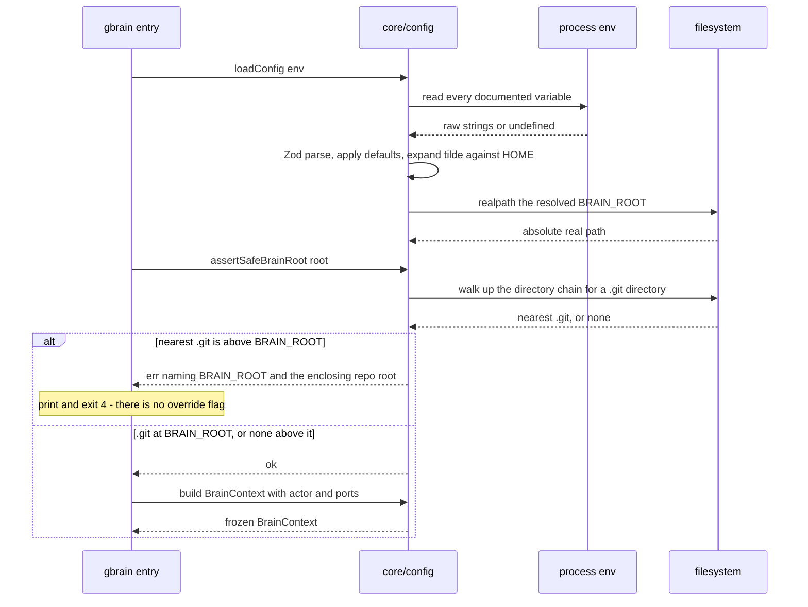

# core/config

## What is core/config

`core/config` is the only module that reads `process.env`. It parses every
variable once at process startup, validates it with Zod, resolves `BRAIN_ROOT`
to an absolute real path, and hands back a frozen `BrainConfig` that every other
module receives inside `ctx`. It is a separate component because it also owns
the startup guard — the check that refuses to run when `BRAIN_ROOT` resolves
inside a git repository that is not the brain's own, which is the single
misconfiguration in this system with lasting consequences.

## Responsibilities

- Read every environment variable exactly once, at process startup.
- Validate the variable set with a Zod schema and apply the documented defaults.
- Fail startup with the offending variable named, rather than on the first
  request that happens to touch it.
- Expand `~` in `BRAIN_ROOT` against `$HOME`, make it absolute, and resolve
  symlinks to a real path.
- Run `assertSafeBrainRoot` at every entry point — `init`, `doctor`, `index`,
  `serve` — so no surface can skip it or disagree about it.
- Refuse to start when the nearest `.git` directory sits above `BRAIN_ROOT`, and
  return a reason naming both paths.
- Resolve `AUTH_REQUIRED` against the selected transport, whose default differs
  between stdio and HTTP.
- Build `BrainContext` from the config plus the resolved actor and the git,
  audit and search ports.

## Not its job

- Reading configuration after startup. Every other module takes `ctx` and never
  touches `process.env`.
- Creating the brain directory or its skeleton — that is `gbrain init` in
  `apps/cli`.
- Deciding whether a path inside the brain is safe — that is `core/paths`.
- Loading agent keys. `.brain/agents.json` belongs to `core/auth`.
- Layering config files, profiles, or merge orders. There is no config file.

## Sequence diagram



## Technical features

- Fourteen variables, all optional, all defaulted: `BRAIN_ROOT` `~/brain`,
  `GIT_AUTOCOMMIT` `false`, `GIT_AUTHOR_SUFFIX` `@g-brain.local`,
  `GIT_DEBOUNCE_MS` `2000`, `MCP_TRANSPORT` `stdio`, `MCP_HTTP_PORT` `8787`,
  `AUTH_REQUIRED` transport-dependent, `MAX_DOC_BYTES` `262144`,
  `RATE_LIMIT_PER_MINUTE` `120`, `AUDIT_MAX_BYTES` `8388608`, `AUDIT_KEEP` `8`,
  `DUPLICATE_THRESHOLD` `0.9`, `SEARCH_MODE` `lexical`, `SESSION_EXPIRY_DAYS`
  `90`.
- `.env.example` in the repo root is the canonical list; the Zod schema is the
  enforcement, and a test keeps the two in step.
- Validation runs once, at startup, and `loadConfig` **throws** rather than
  returning `Result<T>` — this is process start, not a request, and there is no
  caller to hand a typed error to.
- `AUTH_REQUIRED` defaults to `true` under `MCP_TRANSPORT=http` and `false`
  under `stdio`, so it is resolved after the transport is known rather than by a
  literal default in the schema.
- The returned `BrainConfig` is frozen. Nothing mutates it, nothing re-reads the
  environment, and a changed variable takes effect only on restart.
- `BRAIN_ROOT` resolution is three steps in order: expand a leading `~` against
  `os.homedir()`, `path.resolve` to an absolute path, then `realpath` it — so a
  symlinked brain root compares correctly against the paths `core/paths` later
  resolves the same way.
- On Windows `~` expands to `%USERPROFILE%`, giving `%USERPROFILE%\brain`, and
  the resolved root is compared case-insensitively there because the filesystem
  is.
- The default is anchored to `$HOME` and never to `cwd`, because `cwd` is
  whichever working tree the MCP client happened to launch the server from — a
  default relative to it would follow an agent into a source repo.
- The startup guard walks up from `realpath(BRAIN_ROOT)` looking for a `.git`
  entry. Nearest `.git` at `BRAIN_ROOT` itself is the brain's own repo and
  passes. No `.git` anywhere above passes too, and `serve`, `doctor` and `index`
  warn that history is off and `GIT_AUTOCOMMIT` will silently do nothing.
- Nearest `.git` **above** `BRAIN_ROOT` is refused: the process exits 4 with a
  message naming `BRAIN_ROOT`, the enclosing repo root, and the remedy. With
  `GIT_AUTOCOMMIT` on, running there would commit an agent's captures into that
  working tree, which is the accident the whole rule exists to prevent.
- There is no override flag for the guard. Every legitimate arrangement already
  passes it, so an escape hatch would exist purely to permit the damaging case.
- `seed/brain/` inside the g-brain source repo is example content copied out by
  `gbrain init`. It is never a brain root, and pointing `BRAIN_ROOT` at it trips
  the guard by design.
- Honest limit: the guard detects a `.git` entry, not intent. It cannot tell a
  repo you meant to nest inside from one you did not, and it refuses both. It
  also says nothing about a brain root that a CI job or an agent working tree
  writes into by other means — that stays an operator responsibility.
- Honest limit: because the environment is read once, every value is
  restart-scoped. There is no reload signal, and none is planned.

## Interface

```ts
export interface BrainConfig {
  brainRoot: string
  gitAutocommit: boolean
  gitAuthorSuffix: string
  gitDebounceMs: number
  mcpTransport: 'stdio' | 'http'
  mcpHttpPort: number
  authRequired: boolean
  maxDocBytes: number
  rateLimitPerMinute: number
  auditMaxBytes: number
  auditKeep: number
  duplicateThreshold: number
  searchMode: 'lexical'
  sessionExpiryDays: number
}

/** Throws on invalid config — this is startup, not a request. */
export function loadConfig(env: NodeJS.ProcessEnv): BrainConfig

/**
 * Refuses a BRAIN_ROOT inside a foreign git repo.
 * Returns the reason so the CLI can print something actionable.
 */
export function assertSafeBrainRoot(root: string): Result<void>
```

## Related

- [Operations](../09-operations.md) — `BRAIN_ROOT` placement, the startup guard, and the operator's environment reference
- [Tech stack](../02-tech-stack.md) — the configuration table and why Zod
- [Component specifications](../11-components/README.md) — the contract this file expands
- [ADR-0003 — Git as the history layer](../12-adr/0003-git-as-the-history-layer.md) — why `GIT_AUTOCOMMIT` placement carries this much weight
- [FR-18](../../functional/06-functional-requirements.md) and [FR-20](../../functional/06-functional-requirements.md) — the authentication and commit behaviour this configures
- [FR-14](../../functional/06-functional-requirements.md) and [FR-17](../../functional/06-functional-requirements.md) — containment and the limits, both checked against values resolved here
