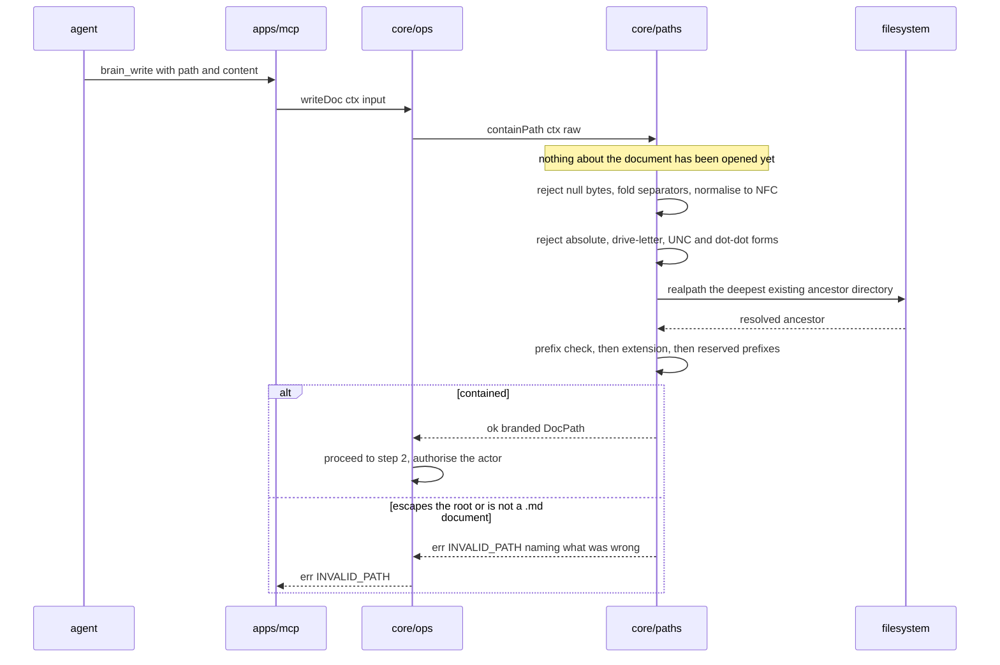

# core/paths

## What is core/paths

`core/paths` is step 1 of the write path and the equivalent first step of every
read. It takes the raw string an agent supplied, normalises it, resolves it
against `BRAIN_ROOT`, and decides whether it is contained — before anything on
behalf of that request is opened, stat-ed or created. An accepted path comes
back branded as a `DocPath`; a rejected one comes back as `INVALID_PATH`. It is
a separate component so there is exactly one resolver in the system, which means
there is exactly one thing to get wrong.

## Responsibilities

- Normalise a caller path: strip control characters, fold separators to POSIX
  `/`, and normalise Unicode to NFC.
- Resolve the normalised path against the already-resolved `BRAIN_ROOT`.
- Reject any form that escapes the root, before and after normalisation.
- Resolve the deepest existing ancestor directory with `realpath` and confirm
  the result still sits inside `realpath(BRAIN_ROOT)`.
- Reject any extension other than `.md`.
- Reject any path under the reserved prefixes `.git/` and `.brain/`.
- Brand an accepted path as `DocPath`, the only value downstream modules accept.
- Convert a `DocPath` to an absolute filesystem path for the modules that
  actually touch disk.
- Return the folder prefix of a `DocPath` for `core/auth` to match scopes
  against.

## Not its job

- Touching the filesystem to answer a containment question, beyond the single
  `realpath` that symlink containment requires.
- Knowing whether the document exists. That is `core/store`.
- Deciding whether the actor may write there. That is `core/auth`, at step 2.
- Any opinion about whether the folder is described in `content-structure.md`.
  Paths are checked for safety, never for structure
  ([ADR-0002](../12-adr/0002-safety-only-write-guards.md)).
- Rewriting or repairing a bad path into a good one. A caller gets
  `INVALID_PATH` and fixes it.

## Sequence diagram



## Technical features

- `containPath` is the single entry point and `core/ops` calls it exactly once
  per request. Reads and writes go through the same function, so there is no
  second resolver to fall out of step.
- Fixed order: null bytes and control characters, separator folding, NFC
  normalisation, absolute-form rejection, `path.resolve` against the root,
  `realpath` of the deepest existing ancestor, prefix check, extension, reserved
  prefixes. Extension is checked last so a traversal attempt never reaches it.
- Traversal is rejected before and after normalisation: `../../etc/passwd`,
  `a/../../b.md`, and percent-encoded variants such as `..%2f..%2fb.md`.
- Root-anchored and platform-absolute forms are all rejected: `/etc/passwd.md`,
  `C:\Windows\notes.md`, and `\\server\share\notes.md`. All three matter,
  because `BRAIN_ROOT` is `%USERPROFILE%\brain` on Windows.
- Null bytes are rejected outright — `notes.md\u0000.txt` is a truncation trick
  against the underlying syscall, not a filename.
- A path whose parent directory is a symlink resolving outside the root is
  rejected. Containment is checked **after** `realpath`, never before, because a
  symlink inside the brain is the only way a spelling that looks contained
  reaches uncontained bytes.
- Anything not ending `.md` is rejected: `notes.txt`, `diagram.png`,
  `notes.md.bak`, bare `README`. v1 stores markdown and nothing else.
- `.git/` is reserved because a write into the git directory is code execution
  on whoever next commits, and it is never a capture. `.brain/` is reserved
  because an agent that can rewrite `agents.json` has granted itself every
  scope, and one that can rewrite `audit.jsonl` has erased its own trail.
- `content-structure.md` at the brain root is an ordinary `.md` file with no
  special case — it passes through exactly this function like any document.
- `DocPath` is `string & { readonly __brand: 'DocPath' }`. Only `containPath`
  constructs one, so a plain `string` will not type-check where a `DocPath` is
  expected, and no downstream module can be handed an unvalidated path by
  accident.
- `toAbsolute` is the only place a `DocPath` becomes an OS path, and it is the
  boundary where POSIX separators become platform separators. `folderOf` is a
  pure string operation returning `''` for a document at the brain root.
- Cost is one `realpath` syscall and string work linear in path length. It is
  not a hot spot, and it is deliberately the first thing every request pays for.
- Containment is safety-only. There is no folder whitelist, `content-structure.md`
  is never consulted, and a path into a folder nobody has described is contained
  and therefore allowed — it becomes drift at step 9, long after the write
  succeeded.
- Case-insensitive filesystems are a real wrinkle and paths are not case-folded:
  on Windows and default macOS, `20-projects/Billing/notes.md` and
  `20-projects/billing/notes.md` are the same file. Containment accepts both
  spellings, and the collision is handled downstream as a replace requiring
  `ifMatch`, not silently here.
- Honest limit: `realpath` inspects the tree as it is at check time. A symlink
  created between containment and the write is a narrow time-of-check window
  that the per-path lock and the atomic rename narrow further but do not close.
  Filesystem access to `BRAIN_ROOT` is out of the threat model for exactly this
  reason.

## Interface

```ts
/** The single entry point. Every caller path passes through here exactly once. */
export function containPath(ctx: BrainContext, raw: string): Result<DocPath>

/** Absolute filesystem path for an already-contained DocPath. */
export function toAbsolute(ctx: BrainContext, path: DocPath): string

/** Folder prefix of a DocPath, '' for a document at the brain root. */
export function folderOf(path: DocPath): string
```

## Related

- [Security](../08-security.md) — the containment procedure and the full table of rejected inputs
- [Storage and concurrency](../04-storage-and-concurrency.md) — path is identity, the path rules, and the case-insensitivity wrinkle
- [Architecture](../01-architecture.md) — where containment sits in the twelve-step write path
- [Component specifications](../11-components/README.md) — the contract this file expands
- [ADR-0002 — Safety-only write guards](../12-adr/0002-safety-only-write-guards.md) — why containment never asks about structure
- [FR-14](../../functional/06-functional-requirements.md) — path containment, rejected before any filesystem access
- [FR-27](../../functional/06-functional-requirements.md) — legible paths as the brain's table of contents
