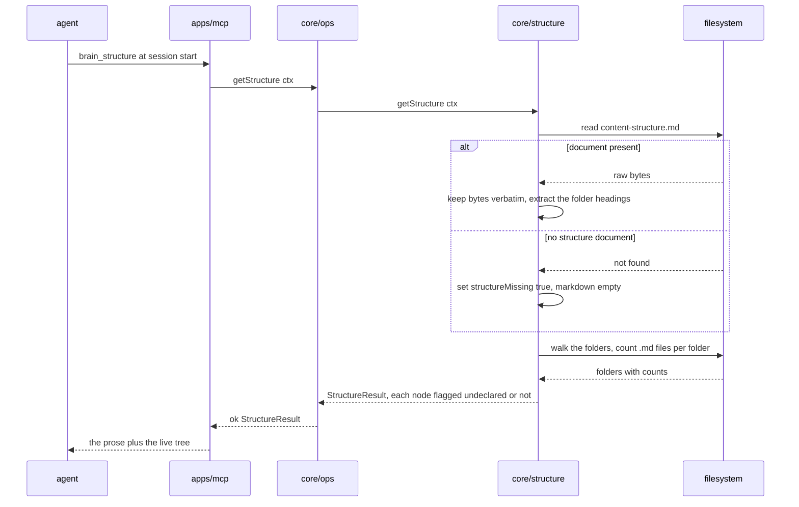

# core/structure

## What is core/structure

`core/structure` answers the question an agent asks at the start of a session:
what does this brain look like, and where does content go? It returns the raw
bytes of `content-structure.md` and a folder tree built from the filesystem, and
it is the only module that compares the two. It exists as a separate component
because the comparison is delicate: the prose is authoritative for routing and
nothing parses it, while the tree is authoritative for what exists and nothing
overrides it ([ADR-0001](../12-adr/0001-structure-doc-is-prose-not-schema.md)).

## Responsibilities

- Read `content-structure.md` at the brain root and return its bytes verbatim.
- Walk the filesystem to build the folder tree with per-folder document counts.
- Include folders the structure document never mentions, because the tree is the
  fact and the document is the intention.
- Return `structureMissing: true` alongside a tree when there is no structure
  document, so a brain mid-setup is still usable.
- Serve the tree on its own for callers that want cheap orientation without the
  document.
- Heuristically extract `## <folder>/` headings from the document to decide
  which folders are described.
- Mark each `FolderNode` `undeclared` when no extracted heading covers it.
- Compute a `DriftRecord` for a path after a write has already succeeded, and
  return `null` when there is nothing to report.

## Not its job

- Parsing the document for meaning. There is no schema, no folder whitelist, and
  no rules engine — the routing decision belongs to the model reading the prose.
- Rejecting anything, ever. Drift is reported after the fact; the write already
  succeeded ([ADR-0002](../12-adr/0002-safety-only-write-guards.md)).
- Creating folders or moving documents. Curation is a human or curator-agent
  action that lands as a reviewable commit.
- Writing the structure document. That goes through `core/ops` and `core/store`
  like any other document.
- Caching the tree across calls. Freshness matters more than the walk costs.

## Sequence diagram



## Technical features

- `markdown` is the file's raw bytes, decoded as UTF-8 and otherwise untouched —
  no frontmatter split, no reformatting, no trimming, no heading rewrite. What
  the author wrote is what the model reads.
- The tree comes from a `readdir` walk of `BRAIN_ROOT`, never from the document.
  `docCount` is the number of `.md` files directly in that folder, and
  `children` nest to the full depth of the tree.
- `.git/` and `.brain/` are excluded from the walk. Everything else is included,
  whether or not any heading covers it.
- A brain with no `content-structure.md` returns `ok` with
  `structureMissing: true`, an empty `markdown`, and a populated tree. Half a
  brain is still a usable brain, and this is what makes `gbrain init` safe to
  interrupt.
- `brainName` is the basename of the resolved `BRAIN_ROOT`.
- Drift detection extracts headings matching `## <folder>/` at the start of a
  line. Placeholder segments — `{topic}`, `{yyyy}`, `{mm}`, `{project}` — match
  exactly **one** path segment and never span a `/`, so `10-knowledge/{topic}/`
  covers `10-knowledge/auth/` but not `10-knowledge/auth/oidc/`.
- `DriftRecord.reason` is one of two values: `undeclared-folder` for a write
  under no described folder, and `root-level-document` for a `.md` file written
  at the brain root that is not the structure document itself.
- `checkDrift` is called at step 9 of the write path, after the atomic rename has
  already succeeded. Its return value is recorded on the audit line and attached
  to `WriteOutput.drift`; it cannot fail the write and has no path to doing so.
- **The heuristic is permitted here precisely because it only reports.** A wrong
  heuristic in a drift report is a spurious line somebody reads and dismisses. A
  wrong heuristic inside a validator loses a capture, permanently and silently.
  That asymmetry is the whole reason routing lives in the model and this
  extraction never gates anything.
- The heuristic misses what it is not shaped for: a folder described at `###`
  depth, one named only in a sentence of prose, or one whose heading omits the
  trailing `/`. Each produces a false drift line, which is cheap. There is no
  case in which it produces a rejection, which would not be.
- The folder walk is O(folders + documents) per call and there is no cache. On a
  brain with thousands of documents `brain_structure` is a full directory
  traversal, which is the cost paid for a tree that is never stale.
- Presets are ordinary markdown files in `seed/presets/`, discovered by
  filename. Adding a preset is adding a file, with no code change here or
  anywhere else.
- `getTree` exists so an agent can orient without pulling the document into its
  context on every call — the prose is tokens in every routing decision, which
  is why the writing guide caps it at roughly 400 lines.
- Honest limit: nothing measures whether the document routes *well*. Accuracy is
  a statistical property of the model reading it, tuned against a fixture set,
  and a badly written document degrades filing invisibly until somebody cannot
  find something.

## Interface

```ts
export interface StructureResult {
  brainName: string
  /** Raw bytes of content-structure.md, verbatim. */
  markdown: string
  structureMissing: boolean
  tree: FolderNode[]
}

export interface FolderNode {
  path: string
  docCount: number
  children: FolderNode[]
  /** True when no '## <folder>/' heading in the structure document covers it. */
  undeclared: boolean
}

export interface DriftRecord {
  path: DocPath
  reason: 'undeclared-folder' | 'root-level-document'
}

export function getStructure(ctx: BrainContext): Promise<Result<StructureResult>>
export function getTree(ctx: BrainContext): Promise<Result<FolderNode[]>>

/** Called AFTER a write has succeeded. Never gates one. */
export function checkDrift(
  ctx: BrainContext,
  path: DocPath,
): Promise<DriftRecord | null>
```

## Related

- [Structure document guide](../03-structure-doc-guide.md) — how to write one that routes well, and the anti-patterns
- [ADR-0001 — The structure document is prose, not schema](../12-adr/0001-structure-doc-is-prose-not-schema.md) — why nothing parses it
- [ADR-0002 — Safety-only write guards](../12-adr/0002-safety-only-write-guards.md) — why drift is reported and never enforced
- [Architecture](../01-architecture.md) — drift as step 9, after the write has succeeded
- [Component specifications](../11-components/README.md) — the contract this file expands
- [FR-01](../../functional/06-functional-requirements.md) — serve the structure document, verbatim, with the live tree and `structureMissing`
- [FR-07](../../functional/06-functional-requirements.md) — the folder tree on its own
- [FR-11](../../functional/06-functional-requirements.md) — writes to undeclared folders succeed and are recorded as drift
- [FR-26](../../functional/06-functional-requirements.md) — `gbrain doctor` reports drift and modifies nothing
