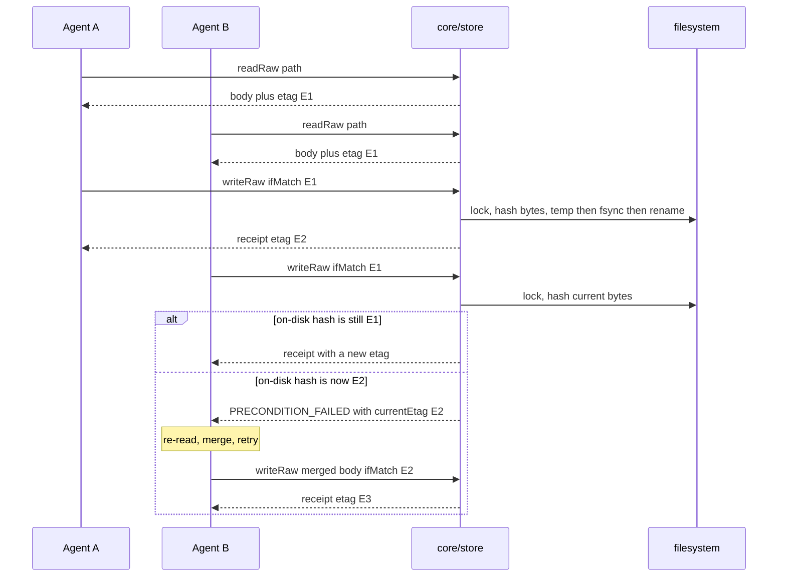

# core/store

## What is core/store

`core/store` is the only module in the system that opens a file handle in the
brain. It owns the atomic write sequence, the content-hash etags that make
optimistic concurrency correct, and the advisory per-path locks that stop two
writers interleaving inside the read-modify-write window. It is a separate
component because everything above it — frontmatter, guards, git, search — is
allowed to be wrong and recoverable, and this one is not: a partial file or a
silently lost paragraph is the single failure the rest of the design cannot
absorb.

## Responsibilities

- Write bytes atomically — temp file in the same directory, `fsync`, `rename`.
- Compute etags as a `sha256` over the exact bytes on disk, after stamping.
- Enforce the precondition contract — create needs none, replace requires `ifMatch`.
- Check existence under the lock, so concurrent creates serialise instead of clobbering.
- Hold an advisory per-path lock across precondition check, stamp, temp write and rename.
- Break a lock whose holder stopped refreshing it, so one crash cannot wedge a document forever.
- Resolve a section-aware append's insertion point under the lock and splice the fragment in.
- Soft delete by mirroring the path into `90-archive/`, and hard delete by unlinking.
- Sweep orphaned temp files left by a crash, at startup and opportunistically on write.

## Not its job

- Frontmatter. The store moves bytes; `core/doc` understands them.
- Guards. By the time the store is called the content is already safe — containment happened in `core/paths`, the secret scan in `core/guards`.
- Git. A commit is a consequence of a write, not part of one, and it is deliberately not held inside the lock.
- Deciding whether a folder is described in `content-structure.md`. Drift belongs to `core/structure`, computed after the write already succeeded.
- Cross-document consistency. A curator moving twelve files makes twelve independent writes and the store promises nothing about the set.

## Sequence diagram



## Technical features

- The write is `open` with the `wx` flag on `.<name>.<uuid>.tmp`, `writeFile`, `fh.sync()`, `rename`, then an `fsync` of the containing directory on POSIX.
- The temp file must live in the **same directory** as the target, because `rename(2)` is atomic only within one filesystem — a temp in `/tmp` or `.brain/tmp/` can cross a mount point and degrade to copy-then-unlink, reopening exactly the partial-file window the sequence exists to close.
- The two syncs do different jobs: the file sync stops a power loss leaving a new directory entry pointing at zeros, the directory sync makes the rename itself durable. Losing the rename is survivable — you get the old document. A zero-length file is not.
- **Windows caveat.** `fs.rename` maps to `MoveFileExW` with `MOVEFILE_REPLACE_EXISTING`, atomic on NTFS for a same-volume move, but it fails transiently with `EPERM` or `EBUSY` when an editor, file indexer or antivirus holds the target open — five retries with jittered backoff up to roughly 300 ms. No directory handle can be opened for `fsync`, so the directory sync is skipped and durability is at the filesystem's discretion.
- Etags are `sha256:<64 lowercase hex>` over the bytes, never a sequence number. A counter needs a store that is wrong the moment a human saves in VS Code, a `git pull` lands a teammate's commit, or a `git checkout` restores an old revision — in all three the stale `ifMatch` would still match and destroy the edit. A content hash makes external editing a first-class case at the cost of one `sha256` per read.
- The precondition contract in full: no file and no `ifMatch` creates; no file with an `ifMatch` is `PRECONDITION_FAILED` with `details.currentEtag: null`; a file with no `ifMatch` is `PRECONDITION_REQUIRED`; a file with a stale `ifMatch` is `PRECONDITION_FAILED` carrying the current etag; a file with a current `ifMatch` is replaced.
- `PRECONDITION_REQUIRED` deliberately does **not** return an etag. A caller that sent no precondition never read the document, and handing it one would let it retry immediately and blind-overwrite whatever is there. `force` overrides the near-duplicate guard and nothing else — no flag bypasses a precondition.
- The existence check runs **inside** the lock, which is what makes "create needs no precondition" safe: two agents creating the same new path serialise, the first creates, the second finds a file and gets `PRECONDITION_REQUIRED`.
- Locks are `proper-lockfile`, advisory, one per resolved document path, redirected with `lockfilePath` to `.brain/locks/<sha256(path)>.lock` so no `.lock` artefact ever appears beside `notes.md` or in someone's git status.
- Stale-lock recovery: the holder refreshes the lock mtime every 5 s, and a lock not refreshed within 10 s is broken by the next acquirer. Acquisition retries with exponential backoff for about 5 s, then fails the write with `RATE_LIMITED` and a retry hint — a reused code whose prescribed agent behaviour is exactly right, with `details` naming the real cause.
- Breaking a live lock under a paused process is not a correctness problem, and that is the point of the etag — the resumed process writes, sees the file moved on, and gets `PRECONDITION_FAILED` like any other stale writer. Locks are an optimisation, the etag is the guarantee.
- `appendRaw` needs no `ifMatch` because the caller supplies only the fragment, so there is no base version it can be wrong about. Under the lock the store reads current bytes, resolves the insertion point, splices and rewrites the whole file atomically — so a named section that moved, grew or was renamed since the caller's last read still receives the fragment. A section that does not exist is created as a new `## <name>` at the end rather than failing. Two concurrent appends serialise and both land, in acquisition order, and nothing beyond that ordering is promised.
- Soft delete mirrors the path into `90-archive/` with the numeric prefix dropped from the first segment — `20-projects/billing/notes.md` becomes `90-archive/projects/billing/notes.md`, gaining `-archived-YYYY-MM-DD` and then a numeric suffix on collision. The archive copy is written **before** the original is unlinked, deliberately, so a crash between the two leaves the document at both paths rather than at neither. Inbound links are not rewritten.
- Filesystem failures are not typed errors. `ENOSPC`, `EIO` and permission failures throw rather than returning a `Result`, because none is an expected condition in the closed error set — and every one of them happens before the rename, so the document on disk is untouched.
- **Honest limits.** No cross-document transactions — twelve moves are twelve writes and a crash halfway leaves six done, with nothing to roll them back. No distributed locking — `proper-lockfile` coordinates processes on one machine through one filesystem, and NFS client caching can race even the read-then-hash check, so share a brain by cloning and pushing, not by mounting. No durability guarantee on network or sync-client filesystems. And A to B back to A is invisible to a content hash, which is the one case a counter would catch and is not worth a store to fix.

## Interface

```ts
export interface WriteOptions {
  ifMatch?: string
  /** Create-only; ignored on replace. */
  force?: boolean
}

export interface WriteReceipt {
  path: DocPath
  etag: string
  created: boolean
}

export function readRaw(
  ctx: BrainContext,
  path: DocPath,
): Promise<Result<{ content: string; etag: string }>>

export function exists(ctx: BrainContext, path: DocPath): Promise<boolean>

/** Atomic. A crash leaves the old file or the new one, never a partial. */
export function writeRaw(
  ctx: BrainContext,
  path: DocPath,
  content: string,
  opts: WriteOptions,
): Promise<Result<WriteReceipt>>

/** Needs no ifMatch and cannot clobber — the insertion point is resolved under the lock. */
export function appendRaw(
  ctx: BrainContext,
  path: DocPath,
  content: string,
  section?: string,
): Promise<Result<WriteReceipt>>

/** Moves to 90-archive/ mirroring the path. hard: true removes the file. */
export function removeDoc(
  ctx: BrainContext,
  path: DocPath,
  opts: { hard?: boolean },
): Promise<Result<{ archivedTo?: DocPath }>>

export function withLock<T>(
  ctx: BrainContext,
  path: DocPath,
  fn: () => Promise<T>,
): Promise<Result<T>>
```

## Related

- [Storage and concurrency](../04-storage-and-concurrency.md) — the deep dive, and the authority on everything above
- [Architecture](../01-architecture.md) — steps 5 and 8 of the twelve-step write path
- [Component specifications](../11-components/README.md) — the interface contract
- [ADR-0003 — Git as the history layer](../12-adr/0003-git-as-the-history-layer.md) — why there is no id index and no database under the store
- [ADR-0002 — Safety-only write guards](../12-adr/0002-safety-only-write-guards.md) — why a precondition rejects and nothing structural does
- Satisfies [FR-02](../../functional/06-functional-requirements.md), [FR-09](../../functional/06-functional-requirements.md), [FR-10](../../functional/06-functional-requirements.md), [FR-12](../../functional/06-functional-requirements.md), [FR-13](../../functional/06-functional-requirements.md)
