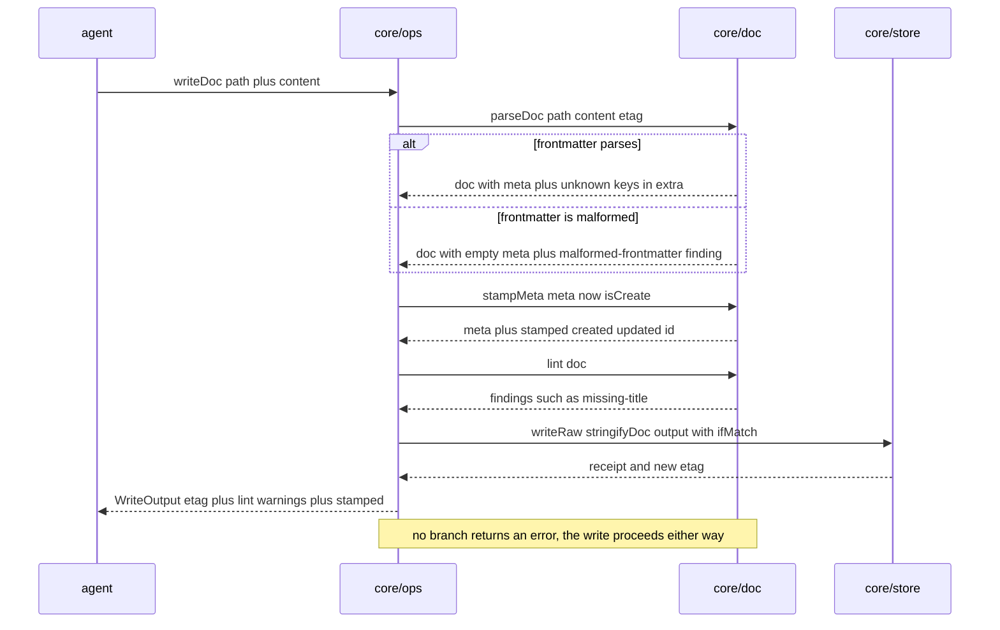

# core/doc

## What is core/doc

`core/doc` is the frontmatter layer: it parses a document tolerantly, stamps the
three fields an agent should never have to think about, lints the rest, and
round-trips the whole thing back to bytes without reformatting the body. It is a
separate component because it is the one place in the write path that has
opinions about document shape and is forbidden from acting on them — every
finding it produces is a warning attached to a successful write. Keeping that
rule in one module is what stops it leaking into `core/guards` as a rejection.

## Responsibilities

- Parse frontmatter with `gray-matter`, tolerantly, and never fail.
- Preserve unknown frontmatter keys in `extra` so a round trip drops nothing.
- Round-trip the body verbatim — no reflowing, no reordering, no reformatting.
- Stamp `created` on first write and preserve an existing value on every replace.
- Overwrite `updated` with the write date on every write, whatever the caller sent.
- Stamp `id` once with `crypto.randomUUID()` and preserve it across replaces and moves.
- Report which fields were stamped, so the surface can tell the agent.
- Lint the document against the named rules and return findings with line numbers.
- Degrade malformed frontmatter to a `malformed-frontmatter` finding plus empty meta.

## Not its job

- **Rejecting.** There is no input `core/doc` refuses. A document with no `title` is a document, and refusing it trains agents to stop capturing ([ADR-0002](../12-adr/0002-safety-only-write-guards.md)).
- Deciding whether frontmatter values are *true*. An `expires` date in the past is linted by `gbrain doctor`, not corrected here.
- Enforcing the type list. An unknown `type` is a lint finding, because types are a filtering convention and adding one is editing the structure document.
- Touching disk. It takes a string and returns a string; `core/store` owns bytes.
- Filing. Whether the path suits the content is drift, computed by `core/structure` after the write.

## Sequence diagram



## Technical features

- Parsing is `gray-matter`, chosen because it is tolerant: an unclosed fence, a tab-indented block, a stray tag it does not recognise all degrade rather than throw.
- `parseDoc` has no failure mode in its signature — it returns `{ doc, findings }`, never a `Result`. Any parse problem becomes a `malformed-frontmatter` finding with an empty `DocMeta`, and the write carries on.
- **Frontmatter that cannot be parsed at all is written through verbatim**, with the lint warning and **no stamping**. When the bytes are not understood, the right move is not to rewrite them.
- Round-tripping preserves the body exactly. The body is spliced back after the frontmatter block, so no markdown normaliser ever runs over a human's file, and a document written by hand and rewritten by an agent shows a diff only where the content actually changed.
- Every frontmatter key outside the known list lands in `extra: Record<string, unknown>` and is re-emitted on `stringifyDoc`. A team that adds `owner:` to their documents does not lose it the first time an agent appends.
- `created` is stamped with today's date when absent, a caller-supplied value is respected because an import needs it, and an existing `created` survives a replace whose incoming body omits it — a rewrite never resets a document's age.
- `updated` is always overwritten with the write date, whatever the caller sent. It describes the file, not the caller's intent.
- `id` is `crypto.randomUUID()`, stamped once and preserved across every replace and every move. Nothing resolves it — it is a correlation token for tying a moved document to its former path in the audit log, not a lookup key, and no operation accepts one.
- Dates are `YYYY-MM-DD`, matching the preset and what a human expects at the top of a file. The honest cost is that `brain_list({ updatedSince })` is day-granular; a full timestamp would buy a finer filter at the price of machine noise in a file humans open daily, and `updated` is never used for concurrency.
- The lint rules, by name: `missing-title`, `unknown-type`, `filename-case` for a filename that is not kebab-case, `multiple-h1` for several `#` headings, `needs-filing-outside-inbox`, and `malformed-frontmatter`. Findings carry a `message` written for an agent and an optional 1-based `line`.
- A stamp-only change is a content change. Rewriting a document on a new day changes `updated:`, which changes the bytes, which changes the etag — correct, because the file differs.
- Findings ride back on `WriteOutput.lint` and go into the audit line, so a brain that accumulates missing titles is visible in `gbrain doctor` rather than in a stream of rejections nobody sees.
- **Honest limits.** Frontmatter is unreliable in aggregate: any consumer filtering on `type` or `tags` must tolerate missing and unexpected values, because nothing ever enforced them. Lint is a report with no mechanism behind it, so it is exactly as useful as the attention curation gets. And `filename-case` is a heuristic over a path — a legitimately non-kebab filename produces a spurious warning, which is the cheap direction for a heuristic to be wrong in.

## Interface

```ts
export interface LintFinding {
  rule: 'missing-title' | 'unknown-type' | 'filename-case'
      | 'multiple-h1' | 'needs-filing-outside-inbox' | 'malformed-frontmatter'
  message: string
  line?: number
}

/** Never fails. Malformed frontmatter becomes a lint finding and an empty meta. */
export function parseDoc(
  path: DocPath,
  content: string,
  etag: string,
): { doc: Doc; findings: LintFinding[] }

export function stringifyDoc(doc: Doc): string

/** Returns the stamped meta plus which fields were added. */
export function stampMeta(
  meta: DocMeta,
  now: string,
  isCreate: boolean,
): { meta: DocMeta; stamped: string[] }

export function lint(doc: Doc): LintFinding[]
```

## Related

- [Content model](../../functional/05-content-model.md) — the deep dive on what a document is and which fields mean what
- [ADR-0002 — Safety-only write guards](../12-adr/0002-safety-only-write-guards.md) — why nothing here rejects
- [Storage and concurrency](../04-storage-and-concurrency.md#frontmatter-stamping) — stamping as step 7, and why a stamp changes the etag
- [Architecture](../01-architecture.md) — step 7 of the twelve-step write path
- [Component specifications](../11-components/README.md) — the interface contract
- Satisfies [FR-09](../../functional/06-functional-requirements.md), [FR-11](../../functional/06-functional-requirements.md), [FR-26](../../functional/06-functional-requirements.md), [FR-27](../../functional/06-functional-requirements.md)
