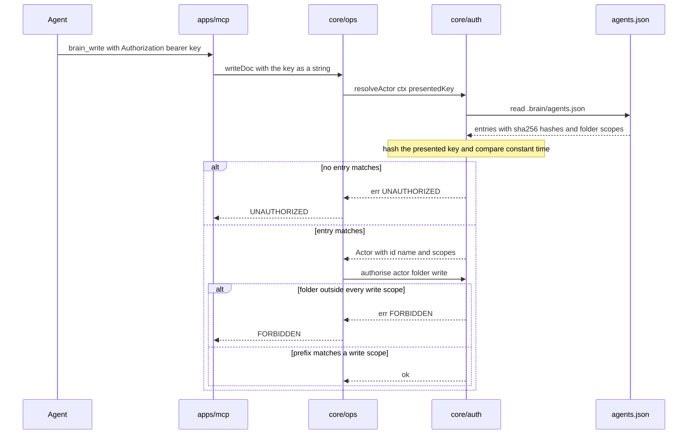

# core/auth

## What is core/auth

`core/auth` answers two questions and nothing else: who is calling, and may they
do this to this folder. It resolves a presented key against the hashed entries
in `.brain/agents.json` and produces an `Actor` with scopes, then checks a
folder prefix for a read or a write. It is a separate component because
authorisation has to live below every surface — if it sat in the MCP transport,
the CLI would be an unauthenticated back door and the next surface added would
be a second implementation to keep in step.

## Responsibilities

- Load `.brain/agents.json` at startup and hold the parsed agent entries for the process lifetime.
- Hash a presented key with SHA-256 and compare against stored hashes in constant time.
- Resolve a matching key to an `Actor` carrying id, name, and the scope list.
- Return `UNAUTHORIZED` when no entry matches, when no key is presented and one is required, or when the file is missing.
- Authorise a `read` or `write` against the folder prefix of the resolved path, returning `FORBIDDEN` on no match.
- Deny by default — a folder covered by no scope entry is refused, including `00-inbox/`.
- Treat a trusted stdio connection as the `local` actor when `AUTH_REQUIRED` is false.
- Generate a key for `gbrain init` — 32 random bytes, base64url — returning the plaintext once and storing only its hash.

## Not its job

- Reading a header. `apps/mcp` extracts the bearer token and passes `core/auth` a plain string or `null`.
- Per-document permissions. Scopes are folder prefixes, and two groups that must not see each other's content run two brains.
- Deciding whether a path is safe or contained. That is `core/paths`, which runs first.
- Re-reading `agents.json` mid-process. Revocation takes a restart, and [operations](../09-operations.md) documents that as a procedure.
- Signing or proving identity. Whoever holds a key is that agent, and `core/auth` asserts attribution rather than establishing it.

## Sequence diagram



## Technical features

- Keys are compared by SHA-256 hash with a constant-time comparison, never by plain string equality, so a leaked `agents.json` hands over no working key and comparison leaks no timing signal.
- Scopes are brain-root-relative folder prefixes matched against the resolved `rel` path; `'/'` covers the whole brain and an empty write list means the key cannot write anywhere.
- Prefix matching is on normalised POSIX segments, so a scope on `20-projects/` covers `20-projects/billing/dunning.md` and does not cover `20-projects-archive/`.
- Enforcement runs at step 2 of the write path inside `core/ops`, which both `apps/mcp` and `apps/cli` call in-process — there is no route to a document that goes around it.
- stdio is trusted as local by default with `AUTH_REQUIRED` false, because the server is a child process the MCP client spawned and whoever can start it already has the user's filesystem access; the actor is recorded as `local` and commits and audit lines carry that name.
- Set `GBRAIN_KEY` in the MCP client's env block when you want per-agent scopes and real audit attribution over stdio — one key per agent, write scope narrowed to the folders that agent actually captures into.
- `AUTH_REQUIRED` defaults to true on the HTTP transport, and turning it off there is an explicit act; bearer keys over plain HTTP are keys in the clear, so TLS is terminated in front of it.
- `UNAUTHORIZED` means unidentified, `FORBIDDEN` means identified and out of scope — the one place the system confirms a key is valid to a caller who cannot use it.
- `FORBIDDEN` is returned for an out-of-scope path whether or not a document exists there, so scopes cannot be used to enumerate content.
- `generateKey` produces 32 random bytes as base64url, prints the plaintext once, and writes only `sha256:…` into `agents.json` — the plaintext is not recoverable afterwards.
- Rotation is an edit to `agents.json`: add the new entry, restart the server, move clients over, remove the old entry. v1 ships no key-management command, so a hash is computed by hand or by `gbrain init` on a scratch brain.
- `agents.json` is read once at startup, so a revoked key keeps working until the process restarts — the honest cost of holding no shared state.
- `.brain/` is gitignored and unreadable through the write path, so an agent cannot grant itself scopes by writing `agents.json`.
- The deliberate limit: scopes are per folder with no per-document ACLs, and a key with read on `20-projects/` reads every project in it.

## Interface

```ts
export function resolveActor(
  ctx: Omit<BrainContext, 'actor'>,
  presentedKey: string | null,
): Promise<Result<Actor>>

export function authorise(
  actor: Actor,
  folder: string,
  operation: 'read' | 'write',
): Result<void>

export function generateKey(
  root: string,
  name: string,
  scopes: Scope[],
): Promise<Result<{ key: string; id: string }>>
```

## Related

- [Security](../08-security.md) — the threat model, `agents.json`, and what is deliberately not protected
- [Architecture](../01-architecture.md) — step 2 of the write path
- [Component specifications](../11-components/README.md) — the contract this implements
- [Operations](../09-operations.md) — key rotation and the environment reference
- [ADR-0002 — Safety-only write guards](../12-adr/0002-safety-only-write-guards.md)
- Satisfies [FR-18](../../functional/06-functional-requirements.md#fr-18--authentication-and-scopes-p0) and supports [FR-19](../../functional/06-functional-requirements.md#fr-19--health-endpoint-p1)
