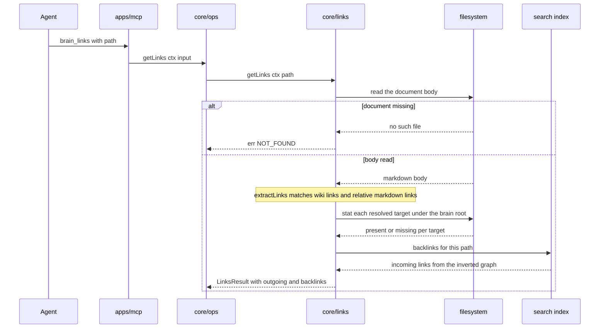

# core/links

## What is core/links

`core/links` makes the link graph navigable in both directions without anyone
having to author the reverse. It extracts `[[path]]` and standard relative
markdown links from a body, resolves each against the brain root, and marks the
ones whose target does not exist. Backlinks come from inverting the forward
graph when the search index builds, so a document is findable from every
document that points at it. It is separate from search because the graph is a
property of the content, not of the ranking.

## Responsibilities

- Extract `[[brain-root-relative/path.md]]` wiki links from a document body.
- Extract standard relative markdown links and treat them as first-class.
- Resolve every extracted target to a `DocPath` against the brain root.
- Mark `broken: true` where the resolved target has no file on disk.
- Return the raw link text alongside the resolved target so a caller can show what was written.
- Read backlinks for a path out of the inverted forward graph the index computed.
- Return outgoing links and backlinks together as one `LinksResult` for `brain_links`.
- Supply the orphan and broken-link inputs `gbrain doctor` reports.

## Not its job

- Rewriting links when a document moves. `doctor` reports what pointed at the old path and a human or the curator agent moves them, landing as a reviewable commit.
- Storing the graph anywhere authoritative. Backlinks are derived like the index, and deleting `.brain/` loses nothing.
- Ranking or searching. Relevance belongs to `packages/search`; this component only says what points at what.
- Inventing a link syntax. Anything that a git host or Obsidian cannot resolve on its own does not belong here.
- Creating the missing target of a broken link. A broken link is reported, never repaired.

## Sequence diagram



## Technical features

- Two syntaxes are supported and neither is privileged: `[[10-knowledge/auth/oidc-token-refresh.md]]` and ordinary relative markdown links such as `[oidc](../auth/oidc-token-refresh.md)`.
- The `[[path]]` form is brain-root-relative, not folder-relative, so the same string is valid from any document and survives being quoted into another one.
- Relative markdown links resolve against the linking document's folder first, then are normalised to a brain-root-relative `DocPath`, so both forms end up as the same key in the graph.
- The `[[path]]` form is chosen because Obsidian resolves it natively — a human who clones the brain walks the graph both ways with no g-brain process running, which is the same constraint FR-27 puts on everything else.
- Resolution goes through the same containment rules as any path, so a link pointing outside the brain root resolves to nothing and is reported broken rather than followed.
- Existence is a `stat` per distinct resolved target with results memoised per call, so a document with fifty links to the same target costs one syscall.
- Backlinks are computed by inverting the forward graph when the index builds, not stored in frontmatter and not written into either document.
- A backlink query is a map lookup against that inverted graph, so it is constant time and costs nothing per call.
- Because the inverted graph is built with the index, backlinks inherit the index's staleness: a link written seconds ago may not appear until the debounced watch picks the file up, and `gbrain index --rebuild` is the answer.
- Outgoing links are always computed live from the body on disk, so they are never stale even when backlinks are.
- Broken links are reported and never auto-repaired — no fuzzy matching to a similar filename, no creation of the missing document.
- A document move is reported by `doctor` as a curation task, not silently rewritten; rewriting links on a move would edit documents nobody asked to edit and would guess wrong on ambiguous targets.
- Anchors and fragments are stripped before resolution, so `[[10-knowledge/auth/oidc.md#refresh]]` resolves to the document and the anchor is preserved only in `raw`.
- Links to non-`.md` targets are not resolved, because v1 stores markdown and nothing else.

## Interface

```ts
export interface Link {
  target: DocPath
  raw: string
  broken: boolean
}

export interface LinksResult {
  path: DocPath
  outgoing: Link[]
  backlinks: Link[]
}

export function extractLinks(path: DocPath, body: string): Link[]

export function getLinks(
  ctx: BrainContext,
  path: DocPath,
): Promise<Result<LinksResult>>
```

## Related

- [Content model](../../functional/05-content-model.md) — the link conventions this implements
- [Search design](../06-search-design.md) — the index build that inverts the forward graph
- [Component specifications](../11-components/README.md) — the contract this implements
- [ADR-0003 — Git is the history layer](../12-adr/0003-git-as-the-history-layer.md) — why derived data is disposable
- [ADR-0004 — Lexical search first](../12-adr/0004-lexical-search-first.md)
- Satisfies [FR-08](../../functional/06-functional-requirements.md#fr-08--links-and-backlinks-p1), feeds [FR-26](../../functional/06-functional-requirements.md#fr-26--doctor-p1), and holds to [FR-27](../../functional/06-functional-requirements.md#fr-27--human-readable-without-any-g-brain-surface-p0)
