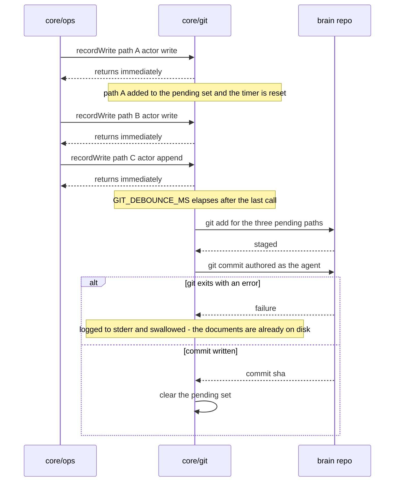

# core/git

## What is core/git

`core/git` is the `GitPort` implementation. It turns accepted writes into
commits in the brain's own repository, authored as the agent that made them, and
serves history, reading a revision, and revert on top of stock git. It exists as
a port rather than inline calls so phase 3 can ship `noopGit` and phase 6 can
drop the real one in without touching the write path — and so a brain with no
git repository behaves identically minus the history.

## Responsibilities

- Record every accepted write into a pending set when `GIT_AUTOCOMMIT` is on.
- Debounce that set by `GIT_DEBOUNCE_MS` so a capture burst becomes one commit.
- Stage and commit the pending paths with a single `git add` and `git commit`.
- Author each commit as the calling agent and commit as g-brain.
- Write a machine-greppable commit subject naming the operation and the path.
- Serve `history` for one path as `git log --follow` over that path.
- Serve `showAt` for a revision as `git show <sha>:<path>`.
- Restore old content through the ordinary write path as a new commit for `revert`.
- Report repo state for `doctor` and `GET /health` — clean, head, commits ahead.
- Suspend committing while the repo is mid-merge, mid-rebase, or mid-cherry-pick, and flush once it is clean.

## Not its job

- Rewriting history. No `amend`, no `rebase`, no `reset --hard`, no `filter-branch`, no force-push, ever — every correction is a new commit.
- Pushing. Cadence is manual, because silently pushing an agent's writes to a shared remote is a surprise worth not having.
- Failing a write. A git error is logged and swallowed; the document is already durably on disk.
- Resolving merge conflicts. Conflict markers are text, the file still reads and indexes, and a human resolves it.
- Being the record of rejected writes. A refused write produces no commit at all — that is `core/audit`.

## Sequence diagram



## Technical features

- `recordWrite` is fire-and-forget and returns synchronously — it never awaits git, never rejects, and never appears in the caller's latency.
- Commit per write is the default shape because it gives exact attribution and single-document revert; debouncing at `GIT_DEBOUNCE_MS`, default `2000`, is the concession to bursts and nothing more.
- Six writes inside one debounce window produce one commit covering six paths; six writes spread over a minute produce six commits.
- The pending set is flushed on shutdown; a `SIGKILL` leaves the change in the working tree and the next commit picks it up.
- `GIT_AUTOCOMMIT` defaults to `false` — installing an MCP server should not start writing commits into a folder nobody has looked at yet, so turning it on is a decision.
- Authorship is `agent-name <agent@g-brain.local>`, the email being the actor plus `GIT_AUTHOR_SUFFIX`, which defaults to the non-routable `@g-brain.local` so no real inbox receives mail addressed to a capture agent.
- Actor names are sanitised into a valid git identity — angle brackets, newlines, and surrounding whitespace stripped — and an actor that sanitises to empty commits as `unknown-agent`.
- Commit subjects are `<operation> <path>` over `write`, `append`, `archive`, `delete`, `revert`, `init`; a debounced batch uses `batch N operations` with one operation line per path in the body, so one `git log --grep` pattern matches both forms.
- The commit message deliberately carries no drift flag, because drift is measured against the current structure document and a commit message cannot be corrected without rewriting history.
- `history` is `git log --follow -- <path>`, paginated; `--follow` matters because soft delete is a move into `90-archive/` and without it archiving would appear to end a document's history.
- A path with no commits returns an empty revision list rather than `NOT_FOUND`, because `GIT_AUTOCOMMIT=false` is a configuration state and not an error.
- `showAt` is `git show <sha>:<path>`, and a sha that does not contain the path returns `NOT_FOUND`; a historical read carries no etag, so read the head before writing.
- `revert` reads the content at the sha and writes it through the ordinary write path, producing a new commit on top — it requires `ifMatch`, re-scans the restored content against the current secret rules, and touches only the one document even when the source commit was a batch.
- A git failure is logged and swallowed. The failure mode is an uncommitted change in the working tree, which the next commit absorbs and `doctor` reports in the meantime.
- If `BRAIN_ROOT` is not a git repository at all, writes still succeed, auto-commit is skipped with a warning on stderr, and history is empty.
- Pushing is manual by default — add a remote and `git push` when you want it, or schedule it yourself; `doctor` prints how many commits ahead of origin you are so forgetting is visible.
- The repo grows forever, because every revision of every document is kept. The cost is loose objects and commit count rather than content bytes, and `git gc` or `git maintenance start` is the whole plan — nothing in g-brain prunes history.

## Interface

```ts
export interface Revision {
  sha: string
  author: string
  date: string
  message: string
}

export interface GitPort {
  /** Fire-and-forget, debounced. Never rejects the caller's write. */
  recordWrite(path: DocPath, actor: Actor, action: string): void
  history(path: DocPath, limit?: number): Promise<Result<Revision[]>>
  showAt(path: DocPath, sha: string): Promise<Result<string>>
  /** Restores old content as a new commit. */
  revert(path: DocPath, sha: string, actor: Actor): Promise<Result<WriteReceipt>>
  status(): Promise<{ clean: boolean; head: string | null; ahead: number }>
}

/** Phase 3 ships this; phase 6 replaces it. */
export const noopGit: GitPort
```

## Related

- [Git and audit](../07-git-and-audit.md) — commit messages, debouncing, revert, and operating the repo
- [ADR-0003 — Git is the history layer, and there is no database](../12-adr/0003-git-as-the-history-layer.md)
- [Architecture](../01-architecture.md) — step 11 of the write path
- [Component specifications](../11-components/README.md) — the contract this implements
- [Storage and concurrency](../04-storage-and-concurrency.md) — etags and why an external commit is detected
- Satisfies [FR-20](../../functional/06-functional-requirements.md#fr-20--commit-per-write-p0) and [FR-21](../../functional/06-functional-requirements.md#fr-21--history-and-revert-p1)
