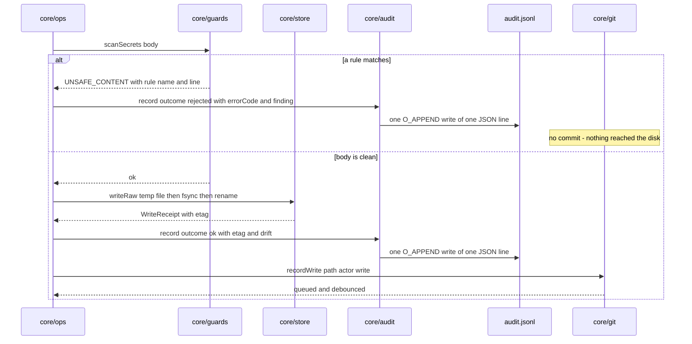

# core/audit

## What is core/audit

`core/audit` appends one JSON line to `.brain/audit.jsonl` for every mutating
operation, whether it succeeded or was refused. It exists because git cannot
record a write that never happened: a rejected `UNSAFE_CONTENT` write produces
no file and no commit, and the audit line is the only trace that someone's agent
tried to put a credential into a shared repo. It also carries the drift flag,
which git deliberately has no opinion about.

## Responsibilities

- Append one serialised JSON line per mutating operation to `.brain/audit.jsonl`.
- Record rejected operations with their typed error code and the rule that fired.
- Record the resulting etag on a successful write.
- Record the drift flag alongside a successful write to an undeclared folder.
- Record the actor as the same string git uses as the commit author, so the two records correlate.
- Rotate by rename when the file passes `AUDIT_MAX_BYTES` and start a fresh file.
- Retain `AUDIT_KEEP` rotated files and delete the oldest beyond that.
- Serve `tail` so `doctor` can report recent rejections without anyone learning `jq`.

## Not its job

- Being tamper-evident. It is plain text anyone with filesystem access can edit, and there is no signing and no hash chain.
- Failing a write. An audit error is logged and swallowed; the document is already on disk.
- Holding the commit sha. The line is appended at step 10 and the commit lands at step 11, debounced — correlate by path and timestamp instead.
- Travelling to the remote. `.brain/` is gitignored, so the log is machine-local and a clone arrives with an empty one.
- Reporting drift over the current tree. `doctor` recomputes that, because declaring a folder clears drift while old lines still say `true` forever.

## Sequence diagram



## Technical features

- `ts` is ISO 8601 UTC with milliseconds, always present, and is the correlation key against `git log --since`.
- `actor` is the resolved agent identity, always present, and is the same string as the git author name — `local` for a trusted stdio caller.
- `action` is one of `write`, `append`, `delete`, `revert`, `structure-write`, always present, and soft delete is recorded as the archive it performs.
- `path` is the brain-root-relative path exactly as requested, always present, so a rejected path is recorded as submitted rather than as normalised.
- `outcome` is `ok` or `rejected`, always present, and is the field every useful query filters on first.
- `etag` is the resulting content hash and is present only when something was written — its absence is the signal that no file changed, which is easier to test for than a null.
- `drift` is a boolean present only on a successful write, and is `true` when the write landed in a folder no `## <folder>/` heading in the structure document covers. The write succeeded; the flag is a note, never a rejection.
- `errorCode` carries the typed code — `UNSAFE_CONTENT`, `CONFLICT`, `PRECONDITION_FAILED`, `TOO_LARGE`, `RATE_LIMITED`, `FORBIDDEN` and the rest of the closed set — and is present only when the outcome is `rejected`.
- `finding` carries the rule name only, such as `aws-secret-access-key`, and never the matched secret. The line would otherwise move a credential from one shared surface to two.
- The serialised line additionally carries the submitted body size, the calling surface, and the drift folder and reason, so a `TOO_LARGE` rejection still records what was attempted — see [git and audit](../07-git-and-audit.md) for the full on-disk field list.
- Writes are a single `O_APPEND` write of one serialised line plus a newline. The file is never read back, never rewritten in place, and never truncated; the single-append discipline is what keeps concurrent processes from interleaving lines.
- Rotation happens by rename at `AUDIT_MAX_BYTES`, default `8388608` — 8 MiB — to `audit-<timestamp>.jsonl`, with a fresh `audit.jsonl` started. Rotation is never a truncation, so nothing is lost at the moment it happens.
- `AUDIT_KEEP` defaults to `8`, so retention is bounded: at roughly 300 bytes a line the defaults hold on the order of a quarter of a million operations, and older lines are discarded. Raise the numbers or copy rotated files somewhere with a retention policy you chose.
- The port never fails a write. An unwritable `.brain/` costs you the trail, not the capture.
- The honest limit: this is plain text in a folder that anyone with filesystem access can edit, delete lines from, or replace. It is an operational record for answering what happened last Tuesday, not tamper-evident evidence, and its integrity is exactly the integrity of the filesystem permissions on `BRAIN_ROOT`.

## Interface

```ts
export interface AuditEntry {
  ts: string
  actor: string
  action: 'write' | 'append' | 'delete' | 'revert' | 'structure-write'
  path: string
  outcome: 'ok' | 'rejected'
  etag?: string
  drift?: boolean
  errorCode?: BrainErrorCode
  /** Rule name only — never the matched secret. */
  finding?: string
}

export interface AuditPort {
  record(entry: AuditEntry): void
  tail(limit: number): Promise<AuditEntry[]>
}

export const noopAudit: AuditPort
```

## Related

- [Git and audit](../07-git-and-audit.md) — the line format, rotation, and why rejections are the point
- [Security](../08-security.md) — the secret scanner whose rejections this records, and what is deliberately not protected
- [Architecture](../01-architecture.md) — step 10 of the write path
- [Component specifications](../11-components/README.md) — the contract this implements
- [ADR-0002 — Safety-only write guards](../12-adr/0002-safety-only-write-guards.md) and [ADR-0003 — Git is the history layer](../12-adr/0003-git-as-the-history-layer.md)
- Satisfies [FR-22](../../functional/06-functional-requirements.md#fr-22--audit-log-p0) and records [FR-11](../../functional/06-functional-requirements.md#fr-11--writes-to-undeclared-folders-succeed-p0)
