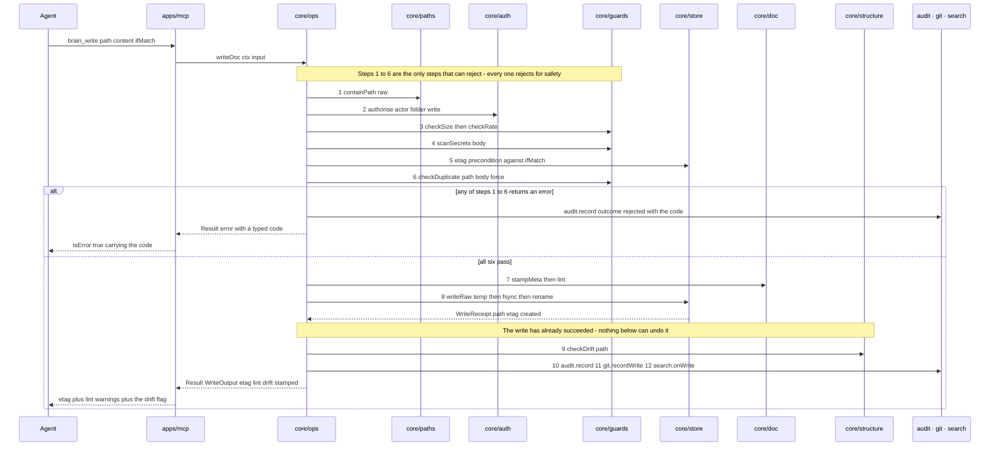

# core/ops

## What is core/ops

`core/ops` is the one module that composes the others into operations a surface
can call. It owns the twelve-step write path — containment, authorisation,
guards, precondition, stamp, atomic write, drift, audit, commit, index — in an
order that is itself part of the design. It is a separate component because that
composition has to exist in exactly one place: the moment `apps/mcp` and
`apps/cli` each assemble their own version of a write, the two surfaces can
disagree about what a write means, and the guarantee that no guard is bypassable
is gone.

## Responsibilities

- Own the twelve-step write path in the order given in [architecture](../01-architecture.md).
- Call `containPath` exactly once per request, at this boundary, so no downstream module ever handles an unvalidated string.
- Authorise the resolved actor for the target folder before any guard runs.
- Run the safety guards — size, rate, secrets, precondition, near-duplicate — and return the first typed rejection.
- Stamp and lint through `core/doc`, then hand contained bytes to `core/store`.
- Compute drift after the write has already succeeded, and attach it to the successful result.
- Fire the deferred work — audit line, debounced commit, index notification — without letting any of it fail the write.
- Record and replay idempotency keys so a retried write returns the original result instead of writing twice.
- Assemble every read operation too: structure, tree, read, list, links, search, history.
- Return `Result<T>` with a typed code and an agent-actionable message, never a formatted string and never a throw for an expected condition.

## Not its job

- Implementing anything. If logic lives in `core/ops` rather than in a module, the module boundary is wrong and the logic moves.
- Knowing about transports, argument shapes, output formatting, or exit codes — those belong to `apps/mcp` and `apps/cli`.
- Deciding whether a path matches the structure document. `core/structure` reports drift and never gates.
- Touching the filesystem, git, or the index directly. It calls `core/store`, `GitPort`, `AuditPort`, and `SearchPort`.
- Holding state between requests, beyond the idempotency records on disk.

## Sequence diagram



## Technical features

- The step order is load-bearing rather than stylistic — each position exists because moving it costs something concrete.
- Containment is step 1 because every later step needs a `DocPath`, and `INVALID_PATH` must be answerable with no filesystem access at all.
- Authorisation is step 2 so that a caller with no write scope for a folder cannot learn from a `CONFLICT` or a `PRECONDITION_FAILED` that a document exists there.
- The secret scan is step 4, before anything touches disk, so `UNSAFE_CONTENT` means nothing was written rather than written-then-removed — a credential that reaches the working tree is a credential in git history.
- The etag precondition is step 5, ahead of the near-duplicate scan, because it is one hash comparison against one file where step 6 reads candidate documents in the folder; failing the cheap check first means a stale writer never pays for the expensive one.
- Drift is step 9, after the write, because a write to an undeclared folder succeeds — drift is an observation attached to a successful result, and refusing instead would train agents to stop capturing.
- `containPath` is called exactly once per request, here. Every other module receives an already-branded `DocPath`, which is why no module has, or needs, a second containment check.
- Steps 10 to 12 are deferred work. A failed audit append, a git error, or a dead index watcher is logged and swallowed, because the document is already safely on disk and losing a capture over a history or index problem is the wrong trade.
- The visible consequence of that rule: in a container with a `safe.directory` problem every write succeeds and no commit appears, which is why `GET /health` reports `git.uncommitted` instead of the write path failing.
- Idempotency records are keyed on `sha256(actor + key + operation + path + sha256(content))`, one small JSON file per completed operation under `.brain/idempotency/`, retained for **24 hours** and swept at startup and opportunistically on write.
- A replay with the same key and the same content returns the stored result and touches no file; a replay with the same key and different content falls through to an ordinary write, where the precondition catches it — so key reuse never has to become an eleventh error code.
- Only successful operations are recorded. A rejected write changed nothing, so re-running its guards on replay is correct rather than wasteful.
- Read operations share the same boundary discipline — contain, authorise, then call the module — so a scoped key cannot list or search its way to a path it may not read.
- The honest limit: nothing mechanical stops logic accumulating here. The dependency test enforces what a module may import, not how much a composer does, so `core/ops` growing a branch that is not a call into a module is a review finding, and the signal that a module is missing.

## Interface

```ts
export function getStructure(ctx: BrainContext): Promise<Result<StructureResult>>
export function getTree(ctx: BrainContext): Promise<Result<FolderNode[]>>

export function readDoc(ctx: BrainContext, input: {
  path: string
  format?: 'raw' | 'parsed'
  at?: string
}): Promise<Result<Doc>>

export function listDocs(ctx: BrainContext, input: {
  folder?: string
  tag?: string
  type?: string
  status?: string
  updatedSince?: string
  limit?: number
  cursor?: string
}): Promise<Result<{ items: DocMeta[]; nextCursor?: string }>>

export function writeDoc(ctx: BrainContext, input: {
  path: string
  content: string
  ifMatch?: string
  force?: boolean
  idempotencyKey?: string
}): Promise<Result<WriteOutput>>

export function appendDoc(ctx: BrainContext, input: {
  path: string
  content: string
  section?: string
}): Promise<Result<WriteOutput>>

export function deleteDoc(ctx: BrainContext, input: {
  path: string
  hard?: boolean
}): Promise<Result<{ archivedTo?: DocPath }>>

export function getLinks(ctx: BrainContext, input: {
  path: string
}): Promise<Result<LinksResult>>

export function search(
  ctx: BrainContext,
  input: SearchQuery,
): Promise<Result<SearchHit[]>>

export function history(ctx: BrainContext, input: {
  path: string
  limit?: number
}): Promise<Result<Revision[]>>

export interface WriteOutput {
  path: DocPath
  etag: string
  created: boolean
  /** Warnings, never rejections. */
  lint: LintFinding[]
  /** Present when the folder is not described in content-structure.md. The write still succeeded. */
  drift?: DriftRecord
  stamped: string[]
}
```

## Related

- [Architecture](../01-architecture.md) — the twelve-step write path this component implements
- [Component specifications](../11-components/README.md) — the interface above, in context
- [Storage and concurrency](../04-storage-and-concurrency.md) — steps 1, 5, 7 and 8 in detail, and the idempotency records
- [ADR-0002 — Safety-only write guards](../12-adr/0002-safety-only-write-guards.md) — why steps 1 to 6 reject only for safety
- [ADR-0001 — The structure document is prose, not schema](../12-adr/0001-structure-doc-is-prose-not-schema.md) — why step 9 reports instead of gating
- Satisfies [FR-09, FR-10, FR-11, FR-13, FR-14, FR-15, FR-16, FR-17, FR-22](../../functional/06-functional-requirements.md)
