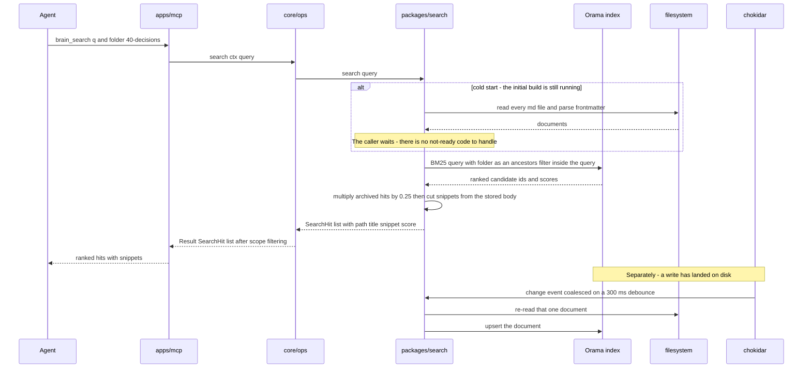

# packages/search

## What is packages/search

`packages/search` ranks documents by relevance from an index built out of the
markdown files. It implements `Retriever` — the only thing `core` calls — and
`SearchPort`, which adds the write notification, the rebuild, and the freshness
report. It sits beside `core` rather than inside it because it is the one
component that is allowed to be stale and is expected to be replaced: everything
it holds is derived from files that are themselves the truth.

## Responsibilities

- Build an in-memory Orama BM25 index from every `.md` file under `BRAIN_ROOT`, excluding `.brain/` and `.git/`.
- Weight `title`, `tags`, and headings above `path` and body, so the lines an author wrote to be found by carry the most signal.
- Apply `folder`, `tag`, and `type` as filters inside the query rather than as a pass over the ranked results.
- Penalise hits under `90-archive/` in ranking, de-prioritising them without ever excluding them.
- Cut a query-dependent snippet from the stored body, falling back to the first paragraph when the match was in the title or path.
- Keep the index fresh from a debounced chokidar watch on the brain root, the single update path for internal and external edits alike.
- Rebuild the whole index on demand for `gbrain index --rebuild`, on a watcher error, and when a snapshot fingerprint does not match.
- Supply ranked candidates to the near-duplicate guard, which then decides against bytes on disk.
- Report freshness — build time, document count, staleness — for `GET /health` and `gbrain doctor` as an observation, never as a gate.

## Not its job

- Holding authority. If search and the filesystem disagree, the filesystem is right and the index is stale.
- Deciding a write. The near-duplicate guard takes candidates from here and then reads the real files.
- Filtering by scope. The retriever is scope-blind; `core` drops hits the calling key cannot read before returning them.
- Embedding anything. `Embedder` is defined and unimplemented, and `SEARCH_MODE` is the seam it arrives through.
- Persisting anything a caller needs. Deleting `.brain/index/` costs a rebuild and nothing else.

## Sequence diagram



## Technical features

- In-memory Orama BM25, in-process: no server, no native dependency, and install is `pnpm install` with no model to download.
- The document is the unit of indexing and there is no chunking — brain documents are short by convention, so chunking would only fragment a document into pieces that compete with each other for the top of the results and would force a reassembly step onto a path that is already the thing an agent reads.
- Field weights are constants tuned against the retrieval fixtures, not configuration: `title` 3.0, `tags` 2.5, `headings` 2.0, `path` 1.5, `body` 1.0.
- `ancestors` holds every folder prefix as an enum array, so a hierarchical `folder` filter becomes an equality test inside the query — without it a prefix filter would be a post-filter that silently truncates a ranked page down to a handful of hits.
- `90-archive/` hits are multiplied by 0.25: low enough to lose to any comparable live document, high enough to win when it is the only match. Excluding them instead would make superseded decisions invisible, and reading what was believed at the time is half the reason the archive is kept.
- Snippets are cut per query from the stored body — the densest window of distinct query terms, expanded to roughly 240 characters and snapped to sentence boundaries — and are never persisted.
- The chokidar watch on `BRAIN_ROOT` ignores `.brain/` and `.git/` and coalesces on a 300 ms debounce per path; more than 50 paths in one window triggers a full rebuild, because a `git pull` is cheaper to rebuild than to apply.
- The watcher is the only update path. A write through `core` touches the file and the watcher notices, exactly as a human saving in VS Code does, so there is no way for an internal write to be indexed while an external edit is missed.
- `gbrain index --rebuild` rebuilds unconditionally, and a snapshot in `.brain/index/` is fingerprinted by schema version, document count, and newest mtime — any mismatch discards it, so plan capacity as if every process start is a rebuild.
- The index holds no authority: a hit is a claim that a document existed, and `brain_read` returning `NOT_FOUND` on a stale hit is the index being wrong, not the read.
- `Embedder` is defined and unimplemented. Enabling hybrid retrieval is an implementation plus `SEARCH_MODE=hybrid` — vectors in the same index, fusion inside `search()`, and no caller, tool, or agent learning which kind of retrieval it is getting.
- Vocabulary mismatch fails **silently**: "why is the queue backing up" does not match a document titled "Dunning retry storm", the agent gets results that are merely wrong, and there is no signal a better match existed. The near-duplicate guard is the only thing that eventually makes it visible.
- No conceptual clustering — a query for an idea returns documents containing the word, not documents about the idea.
- The whole index sits in memory, which is comfortable for thousands of documents and is not a plan for a hundred thousand; that is the binding constraint on brain size.
- Stemming and stop-words are English-first and fixed in v1, so a brain in another language ranks worse and nothing reports that it is happening. Cold start is linear in corpus size, paid on every process start in practice and on every one-shot CLI command by construction.

## Interface

```ts
export interface SearchQuery {
  q: string
  folder?: string
  tag?: string
  type?: string
  limit?: number
}

export interface SearchHit {
  path: DocPath
  title?: string
  snippet: string
  score: number
  updated?: string
  status?: string
}

export interface Retriever {
  search(query: SearchQuery): Promise<Result<SearchHit[]>>
  similar(body: string, folder: string, limit: number): Promise<SearchHit[]>
}

export interface SearchPort extends Retriever {
  onWrite(path: DocPath): void
  rebuild(): Promise<Result<{ documents: number }>>
  freshness(): { builtAt: string | null; documents: number; stale: boolean }
}

/** Defined in v1, implemented later. No caller changes when it is. */
export interface Embedder {
  dimensions: number
  embed(texts: string[]): Promise<Float32Array[]>
}

export const noopSearch: SearchPort
```

## Related

- [Search design](../06-search-design.md) — the index schema, ranking, freshness, and failure modes in full
- [ADR-0004 — Lexical search first](../12-adr/0004-lexical-search-first.md) — why BM25 now and what would trigger a change
- [Component specifications](../11-components/README.md) — the interface above, in context
- [ADR-0003 — Git as the history layer](../12-adr/0003-git-as-the-history-layer.md) — why everything derived is disposable
- [Operations](../09-operations.md) — `gbrain index`, and the index fields on `GET /health`
- Satisfies [FR-16, FR-23, FR-24, FR-25](../../functional/06-functional-requirements.md)
