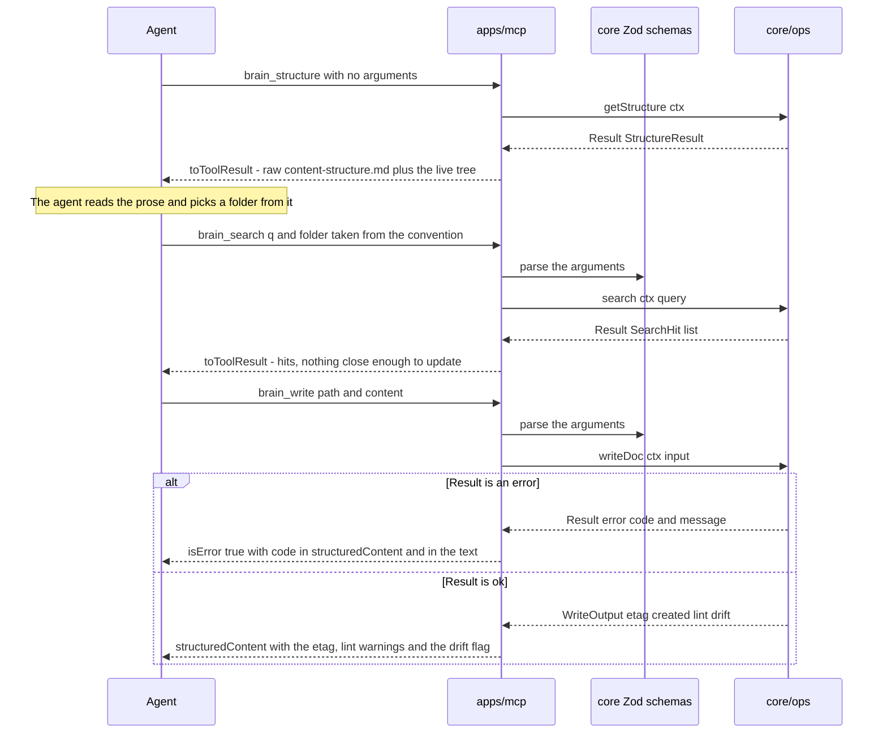

# apps/mcp

## What is apps/mcp

`apps/mcp` exposes `core/ops` to agents as MCP tools, resources, and prompts,
over stdio and streamable HTTP. It validates arguments against schemas exported
from `core`, calls one `core/ops` function, and maps the returned `Result<T>`
onto a tool result. It is a separate package so that the network surface has a
boundary of its own — and it holds no behaviour, because any convenience it
added would be a behaviour the CLI does not have, and the two surfaces would
start to disagree about what a write does.

## Responsibilities

- Register the nine tools, the `brain://structure` resource, and the `define-structure` prompt.
- Validate tool arguments with the Zod schemas imported from `core`, not with a second definition.
- Call exactly one `core/ops` function per tool invocation and return what it returns.
- Map `Result<T>` onto a tool result through `toToolResult`, carrying `BrainError.code` so an agent can branch on it.
- Serve stdio for local clients and streamable HTTP for remote ones, from the same `core` instance.
- Serve `GET /health` on the HTTP transport, the only plain HTTP endpoint in the project.
- Extract the bearer key from the request and hand the string to `core/auth` as an opaque value.
- Send `notifications/resources/updated` when `content-structure.md` changes, so a long session sees a re-onboarding.
- Carry the routing guidance in the tool descriptions, which is the text the model actually reads.

## Not its job

- Any behaviour at all — no convenience default, no retry, no fallback path, no formatted message.
- Filesystem, git, or search access. It depends on `core` and the MCP SDK, and a workspace test asserts it.
- Authorisation decisions. It turns a bearer token into a string and hands it over; `core/auth` decides.
- Defining schemas or error codes. Both come from `core`, so the tool contract and internal validation cannot drift apart.
- Serving documents as resources. A thousand markdown files would flood a client's resource list; `brain_list` and `brain_search` are the tools built to rank them.

## Sequence diagram



## Technical features

- Nine tools, no more: `brain_structure`, `brain_read`, `brain_list`, `brain_tree`, `brain_links`, `brain_write`, `brain_append`, `brain_search`, `brain_history` — the last mutating only when `revertTo` is supplied.
- Every tool carries MCP annotations so a client can reason without parsing prose: `readOnlyHint` on the six read tools, `idempotentHint` on `brain_write` with an `idempotencyKey`, and `destructiveHint: false` on all of them, because delete is a move to `90-archive/` and revert is a new commit.
- The `brain://structure` resource serves the structure document followed by the folder tree as one markdown body, readable with no unwrapping.
- Attaching that resource for a whole session is the cheapest way to make every write in the session land correctly, and the reason is mechanical: a resource in context needs no decision, where an agent that must decide to call a tool first will sometimes not. It costs the document once per session instead of once per capture.
- The `define-structure` prompt returns a message sequence that reads the current structure or a named preset, interviews the user, shows a diff, and writes the result back through `brain_write` with an `ifMatch` — the structure document gets the ordinary write path, not a privileged one.
- Zod schemas are `core`'s input types, exported and registered here, which is why `zod` is a `core` dependency: one definition serves the tool contract and internal validation, so they cannot disagree.
- `toToolResult` is a switch on `error.code` with no logic. On success it returns the value as text and as `structuredContent`; on failure it sets `isError: true` and puts the code in both places — `structuredContent.code` for a client that branches, and `CODE: message` text for the model, which reads the text.
- **Tool descriptions are part of the product.** The model reads them before anything else, so they carry the routing guidance — call `brain_structure` before the first write, search before you create, the inbox is a correct answer, append rather than rewrite, never write secrets. Changing their wording is a product change validated against the routing fixtures, not a refactor.
- The stated cost of that choice: the full tool list is roughly 700 to 900 tokens in every session that connects, before a single call. It is paid because the guidance has to be where the decision happens.
- Both transports mount the identical tool set from the same `core` instance; nothing is available on one and not the other.
- stdio is a local child process of a client the user already trusts, so `AUTH_REQUIRED` defaults to false there and the audit actor is `local`; HTTP defaults to true and every request carries `Authorization: Bearer <key>`.
- On stdio, stdout is the protocol channel and carries nothing but MCP frames — a stray `console.log` in a handler breaks the session, which is the most common way to break a stdio server. Logs and the banner go to stderr.
- `GET /health` answers without auth and always returns a body: `status`, `version`, `uptimeSeconds`, `brainRoot` with readability and writability, `structure` presence and size, document count, `index` mode, count, `builtAt`, `staleSeconds` and `watching`, and `git` repo, autocommit, head, uncommitted and unpushed. Without a valid key the response is the status and version only.
- `status` is `degraded` only for a real fault — an unwritable root, a detached watcher, autocommit on with no repo — never for drift, inbox depth, or unpushed commits, because a health check that fails on normal states gets ignored.
- The honest limit: protocol failures are not `BrainError`s. An unknown tool name, arguments that fail Zod parsing, or a dead transport surface as JSON-RPC errors from the SDK, so an agent seeing anything outside the ten typed codes is looking at a wiring problem that retrying will not fix.

## Interface

```ts
export function createServer(ctx: BrainContext): McpServer
export function startStdio(ctx: BrainContext): Promise<void>
export function startHttp(ctx: BrainContext): Promise<{ port: number; close(): Promise<void> }>

/** The single mapping point. A switch on error.code — no logic. */
export function toToolResult<T>(result: Result<T>): CallToolResult
```

## Related

- [MCP reference](../05-mcp-reference.md) — every tool's arguments, result shape, errors, and shipped description
- [Component specifications](../11-components/README.md) — the interface above, in context
- [Architecture](../01-architecture.md) — why all behaviour lives in `core` and surfaces are mappings
- [Security](../08-security.md) — agent keys, scopes, and where authorisation is enforced
- [ADR-0002 — Safety-only write guards](../12-adr/0002-safety-only-write-guards.md) — why `brain_write` returns drift instead of an error
- Satisfies [FR-01, FR-04 – FR-13, FR-18, FR-19, FR-21, FR-23](../../functional/06-functional-requirements.md)
