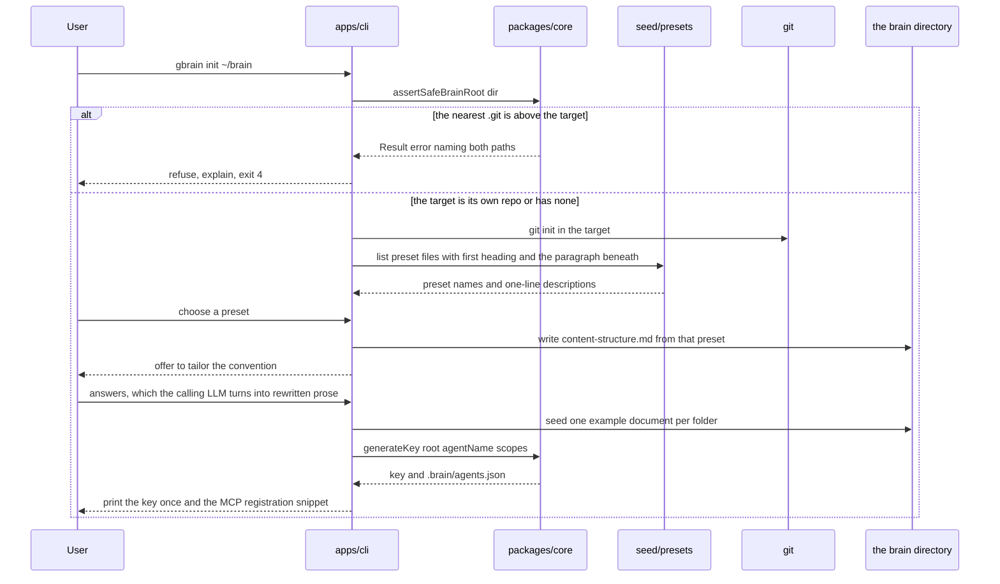

# apps/cli

## What is apps/cli

`apps/cli` is the operator surface: `gbrain init | doctor | index | serve`. It
calls `packages/core` in the same process — it never talks to the MCP server
over a socket — and its whole job is turning arguments into `core` calls and
`Result<T>` into printed output and exit codes. It exists as a separate package
because the two jobs it does are not agent jobs: creating a brain before any
agent exists, and reporting the imperfections the safety-only guards deliberately
let through.

## Responsibilities

- `init` — resolve and guard the target directory, `git init` it, write `content-structure.md` from a preset, offer tailoring, seed examples, generate the first agent key, print the MCP registration snippet.
- Discover presets from `seed/presets/` at run time, so adding a preset file needs no code change.
- `doctor` — print drift, broken links, orphans, near-duplicate candidates, inbox contents with their stated filing reasons, expired content, and lint warnings.
- `index` — rebuild the search index, watch it, or report its statistics.
- `serve` — start the MCP transport, stdio or HTTP, as a wrapper over `apps/mcp`.
- Run the `BRAIN_ROOT` startup guard on every command, through the same `core` function every other entry point uses.
- Map each `BrainError.code` onto a distinct, documented exit code so scripts can branch on the outcome.
- Degrade to flags when stdin is not a TTY, so every command runs in CI instead of hanging on a prompt.
- Print the generated agent key exactly once, and write the registration snippet into the new brain's `README.md`.

## Not its job

- Behaviour. `doctor`'s checks are `core` functions and `runDoctor` lives in `core`; the CLI formats what it returns.
- Talking to a running MCP server. Several `gbrain` invocations and a server against one brain coordinate through per-path locks and etags on the filesystem.
- Modifying content in `doctor`. It reports, and the curation actions it names are for a human or the curator agent to take as reviewable commits.
- Offering an override for the `BRAIN_ROOT` guard. The only legitimate arrangement passes it, so a flag would exist purely to permit the damaging case.

## Sequence diagram



## Technical features

- `gbrain init [dir]` takes `--preset`, `--force`, `--no-seed`, `--no-git`, `--agent`, and `--yes`; it defaults to `~/brain`, anchored to `$HOME` and never to the working directory, which moves.
- `gbrain doctor` takes `--json`, `--folder`, `--fail-on <none|any|drift|links>` and `--quiet`; `gbrain index` takes `--rebuild`, `--watch`, `--stats` and `--json`; `gbrain serve` takes `--stdio`, `--http`, `--port`, `--brain-root` and `--no-watch`.
- Presets are discovered by reading `seed/presets/` at run time and taking each file's first `#` heading as the name and the paragraph beneath it as the description — dropping a file in makes it appear in the list with no code change, and a workspace test asserts that.
- The tailoring step hands the user's answers to the calling LLM, which rewrites the preset prose: renaming folders, dropping sections that do not apply, adding domain-specific ones, and keeping the belongs-here and does-not-belong-here lines that do the routing work. Declining leaves the preset as-is, which is a fine place to start.
- `init` refuses a non-empty brain without `--force`, and even with `--force` never overwrites an existing `content-structure.md` — the convention is the one file worth protecting from a re-run.
- The `BRAIN_ROOT` guard resolves the target to a real path and walks up looking for `.git`: at the target is fine, none above is fine for `init`, one above is refused with a message naming both paths and the enclosing repo. It is one `core` function run by every entry point, so no command can skip it or disagree about it.
- Non-interactive degradation is by TTY detection, not by a flag: with stdin not a TTY every prompt takes its flag value or its default, so `init` completes in CI rather than blocking on a question nobody will answer.
- `doctor` reports seven categories in a fixed order — drift, broken links, orphans, near-duplicate candidates, inbox contents with reasons, expired content, lint warnings — and modifies nothing, which the fixture test asserts by comparing the brain byte for byte afterwards.
- `doctor` exits 0 even with findings, because findings are the normal state of a healthy brain; `--fail-on` opts into exit 3 when it is wired to a scheduler. A non-zero exit means a real fault, not a full inbox.
- `runDoctor` lives in `core` rather than in the CLI so the curator agent can call it through MCP later without the checks being reimplemented on the other side.
- Exit codes are one scheme across all four commands: 0 success, 1 failure such as an unreadable path or a git error, 2 usage error, 3 findings under `--fail-on`, and 4 refused for safety — the `BRAIN_ROOT` guard, `init` over a non-empty brain without `--force`, and every typed safety rejection from `core`. Code 4 is deliberately distinct from 1 because it means the system worked and said no.
- `doctor` builds a fresh index in process and never trusts the on-disk snapshot: a diagnostic that reads a possibly stale cache reports on the cache.
- `serve --stdio` prints the banner to stderr and nothing at all to stdout; both transports shut down cleanly on `SIGINT` and `SIGTERM`, detaching the watcher and flushing any debounced commit before exiting 0.
- The honest limits: `doctor` and the initial index build walk the corpus and read frontmatter, so they are comfortable in the hundreds to low thousands of documents and genuinely slow beyond that, and the drift check is a heuristic over `## <folder>/` headings — a wrong heuristic produces a spurious line in a report, which is the only place a heuristic is allowed to be wrong.

## Interface

```ts
export interface DoctorReport {
  drift: DriftRecord[]
  brokenLinks: { from: DocPath; to: string }[]
  orphans: DocPath[]
  duplicates: { a: DocPath; b: DocPath; similarity: number }[]
  inbox: { path: DocPath; reason?: string }[]
  expired: { path: DocPath; expires: string }[]
  lint: { path: DocPath; findings: LintFinding[] }[]
}

/** Lives in core so the curator agent can call it through MCP later. */
export function runDoctor(ctx: BrainContext): Promise<Result<DoctorReport>>

export function initBrain(input: {
  dir: string
  preset: string
  force?: boolean
  interactive: boolean
}): Promise<Result<{ root: string; key: string; snippet: string }>>
```

## Related

- [Operations](../09-operations.md) — every flag, the exit code table, the startup guard, and routine curation
- [Phase 5 — CLI and onboarding](../../../plan/phases/05-cli-and-onboarding.md) — the phase that builds this, and its definition of done
- [Component specifications](../11-components/README.md) — the interface above, in context
- [ADR-0002 — Safety-only write guards](../12-adr/0002-safety-only-write-guards.md) — why `doctor` exists as the counterweight to permissiveness
- [Onboarding](../../functional/03-onboarding.md) — presets and first run from the user's side
- Satisfies [FR-03, FR-24, FR-26](../../functional/06-functional-requirements.md)
