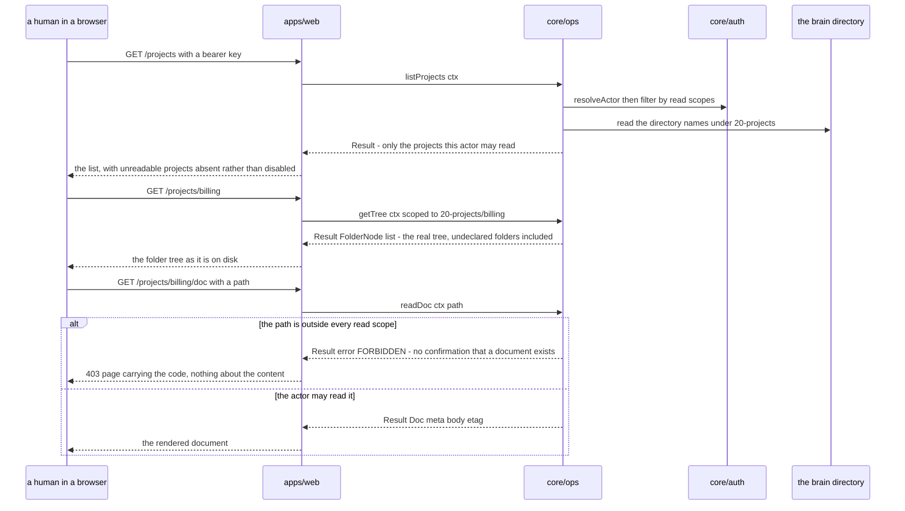

# apps/web

## What is apps/web

`apps/web` is the human surface: list the projects this caller may read, open
one, walk its real folder tree, read a document, search. It calls `core/ops` in
process and maps each `Result<T>` onto a page and an HTTP status, exactly as
`apps/mcp` maps one onto a tool result and `apps/cli` maps one onto an exit
code. It is a separate package for the same reason `apps/mcp` is — a surface
with a network boundary needs a boundary of its own — and it holds no behaviour,
because a convenience here would be a convenience the other two surfaces do not
have, and then the three would disagree about what the brain contains.

It exists because reading the brain as a git repo shows the whole repository or
nothing, and a team wants a view that opens at *the projects I can see*
([ADR-0009](../12-adr/0009-read-only-web-ui.md)).

## Responsibilities

- Render the project list: directories under `20-projects/`, filtered by the caller's read scopes, as `core/ops` returns them.
- Render one project's folder tree from `getTree`, and one document from `readDoc`.
- Render search results from `search`, scoped to the selected project where the reader asked for that.
- Extract a bearer key from the request and hand the string to `core` as an opaque value, as `apps/mcp` does.
- Map each `BrainError.code` onto an HTTP status and a page, in one place, with no branch that is not that mapping.
- Present a project the caller cannot read as **absent** — never as a disabled row, a greyed entry, or a count of things withheld.
- Serve `GET /health` from the same reporting `core` already produces for `apps/mcp`, so a deployment has one health shape.
- Shut down cleanly on `SIGINT` and `SIGTERM`, as the other transports do.

## Not its job

- **Writing anything.** No create, edit, delete, move, rename or upload. Writes stay on MCP, and adding one here reverses [ADR-0009](../12-adr/0009-read-only-web-ui.md) rather than extending it.
- **Authenticating people.** There are no users, sessions, logins or providers. The UI carries the actor the existing model gives it — `local` where `AUTH_REQUIRED` is false, or the key presented on HTTP.
- **Deciding who may see what.** It renders the list `core/auth` permitted. A filter applied in the browser, or in this package, is a second authorisation implementation and the point at which the two can disagree.
- **Holding a document open.** Nothing here subscribes, locks, or keeps an editing session, which is the condition on which realtime collaboration was deferred.
- **Presenting an idealised structure.** The tree says what *is*, including undeclared folders and the inbox ([ADR-0001](../12-adr/0001-structure-doc-is-prose-not-schema.md)).
- Filesystem, git, or search access. It depends on `core` and its view layer, and the architecture test asserts that.
- Creating a project. A project is a folder that a write created; a list is not a place to make one.

## Sequence diagram



## Technical features

- **Four read views and nothing else:** the project list, one project's tree, one document, and search results. Each is one `core/ops` call — `listProjects`, `getTree`, `readDoc`, `search` — and the view is a rendering of what came back.
- **The route table is the whole contract with the browser**, and every route is a `GET`:

  | Route | Calls | Renders |
  |---|---|---|
  | `GET /` | `listProjects` | the projects this actor may read |
  | `GET /p/{project}` | `getTree` | that project's real folder tree |
  | `GET /p/{project}/doc?path=` | `readDoc` | one document |
  | `GET /search?q=&project=` | `search` | ranked hits |
  | `GET /health` | the same report `apps/mcp` serves | status and version |

  There is no `POST`, `PUT`, `PATCH` or `DELETE` anywhere in the package, which
  is a one-line thing to assert in a test and worth asserting.
- **The project code is sugar over a folder**, resolved to `20-projects/{project}/` by `core` and never by this package ([ADR-0008](../12-adr/0008-project-scope-is-the-project-folder.md)). `apps/web` passes the code through; it does not concatenate a path.
- **Authorisation is the folder scoping that already exists.** `Scope { folder, read, write }` decides, and a `recall` key — read everywhere, write nowhere — is the shape a browser deployment wants ([ADR-0007](../12-adr/0007-multi-writer-safety.md)).
- **`project:` frontmatter is never consulted for access.** It may be shown, and it may filter a search the reader asked to filter, but a view that hid or revealed a document on the strength of a field an agent can type would be the authorisation bypass ADR-0008 exists to prevent.
- **Absent, not disabled**, is a rule about every list on every page. `core/auth` declines to name folders a caller cannot see because naming them leaks the shape of the brain; a UI that rendered them greyed out would hand back exactly what `core` withheld.
- **`FORBIDDEN` on a deep link is safe to render as `FORBIDDEN`.** `core/auth` returns it for an out-of-scope path whether or not a document exists there, so the page confirms the caller's key is out of scope and confirms nothing about content.
- The error mapping is one switch, the web analogue of `toToolResult` and of the CLI's exit codes: `UNAUTHORIZED` → 401, `FORBIDDEN` → 403, `NOT_FOUND` → 404, `INVALID_PATH` → 400, `RATE_LIMITED` → 429, anything else → 500, with `BrainError.code` printed on the page so a reader can quote it. **The typed code is the truth and the status is the mapping** — no `core` function ever returns a status.
- Documents render from `readDoc`, so frontmatter is shown as metadata rather than as a wall of YAML above the prose. **`?view=markdown` is the raw form** — the whole file including frontmatter, rebuilt with `stringifyDoc` so what is shown round-trips to what is on disk. Preview is the default. A brain that is plain markdown should be readable as plain markdown, and the toggle is the one query parameter that promise costs.
- **Rendered markdown never renders raw HTML.** Documents are written by agents, so an HTML body would be script injection with extra steps; the renderer runs without `rehype-raw` and shows such a body as visible text. Verified against a document containing a script tag and an `onerror` attribute — both came back escaped.
- **`[[wiki links]]` become ordinary links in the preview**, resolved against the document route. They are left alone in markdown mode, which shows the file as written. Obsidian resolves the `[[…]]` form natively; a browser does not, and rewriting it at render time keeps the stored form the one thing it has always been.
- **Search here is the same ranking the agents get** — `packages/search` through `core/ops`, with the index allowed to be stale — so a reader and an agent looking for the same thing see the same order, and a reader reporting bad results is reporting something reproducible.
- Deployment is the `apps/mcp` HTTP story unchanged: `AUTH_REQUIRED` defaults to true over HTTP, bearer keys over plain HTTP are keys in the clear, and TLS is terminated in front of it.
- **Undecided, and deliberately left so: how a browser presents that key.** ADR-0009 fixes the model — the UI carries a bearer key on HTTP — and does not say through what mechanism a person's browser attaches one to an ordinary navigation. That needs deciding before this ships, and it is a small decision only as long as the answer does not quietly become a session system.
- **The view stack is Next.js (App Router), Tailwind and shadcn/ui**, chosen by the repo owner. Pages are React server components that call `core/ops` in process, so the dependency rule below is satisfied by construction: the data is fetched on the server and no brain access reaches the browser. The build is `next build` rather than tsup, which is why `turbo.json` lists `.next/**` alongside `dist/**`.
- The honest costs, from ADR-0009 and unchanged by anything here: access is **per key, not per person**, so two people sharing a key are indistinguishable, revoking one person means rotating a key others hold, and the audit log names a key where a team will want a name. Giving one person one project means issuing and distributing a scoped key by hand — workable for a handful of people, and not beyond that.
- The other honest cost: **a read-only UI invites requests to make it writable**, and a project list invites requests to create projects from it. Both reverse a recorded decision and want an ADR rather than a pull request.

## Interface

```ts
export function startWeb(ctx: BrainContext): Promise<{ port: number; close(): Promise<void> }>

/** The single mapping point. A switch on error.code — no logic. */
export function toHttpResponse<T>(result: Result<T>): {
  status: number
  /** BrainError.code on failure, so the page can print it verbatim. */
  code?: BrainErrorCode
  body: T | { code: BrainErrorCode; message: string }
}
```

The project list comes from `core/ops`, already filtered:

```ts
/** Owned by core/ops. Directory names under the projects folder, filtered by the actor's read scopes. */
export function listProjects(ctx: BrainContext): Promise<Result<ProjectSummary[]>>

export interface ProjectSummary {
  /** The directory name under the projects folder, which is also the project code. */
  project: string
  docCount: number
  /**
   * Repositories this project maps to, from `repos:` on the project README —
   * the field ADR-0005 already defines as context, never identity. Optional:
   * a project may map to none. Shown, and never consulted for access, for the
   * same reason `project:` is not: frontmatter is agent-written.
   */
  repos?: string[]
}
```

## Related

- [ADR-0009 — A read-only web UI, and no identity system](../12-adr/0009-read-only-web-ui.md) — the decision this component implements, and its costs
- [ADR-0008 — A project is a folder, and that folder is the access boundary](../12-adr/0008-project-scope-is-the-project-folder.md) — why a project code resolves to a folder and authorisation never reads frontmatter
- [ADR-0007 — Multi-writer safety](../12-adr/0007-multi-writer-safety.md) — the key profiles this surface rides on
- [Component specifications](../11-components/README.md) — the interface above, in context
- [Architecture](../01-architecture.md) — why all behaviour lives in `core` and surfaces are mappings
- [Security](../08-security.md) — scopes, and where authorisation is enforced
- [core/auth](./07-core-auth.md) — the module that decides what this surface may show
- [Personas and jobs](../../functional/02-personas-and-jobs.md) — the human reader this exists for
- Satisfies [FR-33, FR-35 and FR-36](../../functional/06-functional-requirements.md) — the project code, the scope-filtered project list, and a surface that reads and never writes. [FR-34](../../functional/06-functional-requirements.md) constrains it: authorisation reads only the path and the scopes, never document content. [ADR-0009](../12-adr/0009-read-only-web-ui.md) is its source.
