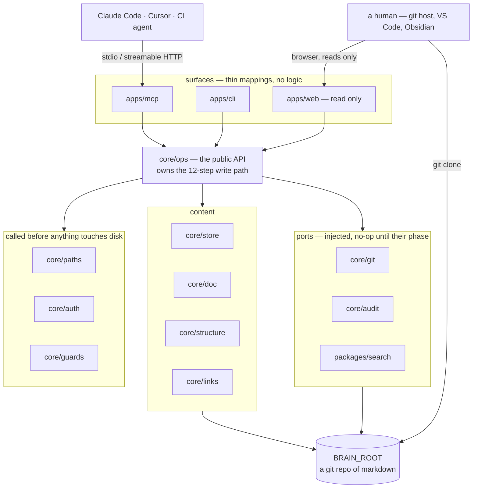

# Components

The technical documents in `docs/technical/` are organised by **concern** —
storage, search, security, git. This folder is the same system organised by
**component**: one document each, all on the same template.

Read a concern document to understand a problem. Read a component document to
build the thing.

## The template

Every file in this folder has these sections, in this order:

| Section | Contains |
|---|---|
| **What is `x`** | Two to four sentences — what it exists to do, and why it is a separate component |
| **Responsibilities** | One-liners. What it owns |
| **Not its job** | One-liners. What it must refuse to grow into, and where that belongs instead |
| **Sequence diagram** | Its most important flow, end to end, with the failure branch |
| **Technical features** | Concrete engineering detail — algorithms, defaults, formats, error codes, platform caveats, and the honest limits |
| **Interface** | The TypeScript contract |
| **Related** | The concern document, the ADR, the FR numbers |

**The "Not its job" section is the one that does the real work.** `core/doc`
says rejecting is not its job; `core/paths` says it has no opinion on whether a
folder is described in `content-structure.md`; `core/ops` says implementing
anything is not its job. Those are the rules that erode first, stated where
someone would otherwise break them.

## The components

| # | Component | Owns | Concern doc |
|---|---|---|---|
| [01](./01-core-config.md) | `core/config` | Environment, `BRAIN_ROOT` resolution, the startup guard | [operations](../09-operations.md) |
| [02](./02-core-paths.md) | `core/paths` | Containment, before any filesystem access | [security](../08-security.md) |
| [03](./03-core-structure.md) | `core/structure` | Serve the structure document verbatim, build the tree, compute drift | [structure-doc guide](../03-structure-doc-guide.md) |
| [04](./04-core-store.md) | `core/store` | Atomic writes, etags, locks, append, soft delete | [storage and concurrency](../04-storage-and-concurrency.md) |
| [05](./05-core-doc.md) | `core/doc` | Frontmatter parse, stamp, lint — never reject | [content model](../../functional/05-content-model.md) |
| [06](./06-core-guards.md) | `core/guards` | The complete list of reasons a write may be refused | [security](../08-security.md) |
| [07](./07-core-auth.md) | `core/auth` | Keys and per-folder scopes, enforced in `core` | [security](../08-security.md) |
| [08](./08-core-links.md) | `core/links` | Extract, resolve, backlink | [search design](../06-search-design.md) |
| [09](./09-core-git.md) | `core/git` | Commit per write, history, revert | [git and audit](../07-git-and-audit.md) |
| [10](./10-core-audit.md) | `core/audit` | The append-only record, including rejections | [git and audit](../07-git-and-audit.md) |
| [11](./11-core-ops.md) | `core/ops` | The public API and the twelve-step write path | [architecture](../01-architecture.md) |
| [12](./12-search.md) | `packages/search` | Ranking, from an index allowed to be wrong | [search design](../06-search-design.md) |
| [13](./13-apps-mcp.md) | `apps/mcp` | Tools, resources, prompts, both transports | [MCP reference](../05-mcp-reference.md) |
| [14](./14-apps-cli.md) | `apps/cli` | `init`, `doctor`, `index`, `serve` | [operations](../09-operations.md) |
| [15](./15-apps-web.md) | `apps/web` | Read-only browsing: projects, folder tree, document, search | [ADR-0009](../12-adr/0009-read-only-web-ui.md) |

## How they fit together



Two things to read out of it. **Nothing reaches `BRAIN_ROOT` except through
`core`** — and the human on the right, who reaches the same files with no
g-brain process running at all. **No module imports `ops`**; the arrows point
one way.

## Shared types

Defined once in `packages/core/src/types.ts` and imported by every component and
both surfaces. This file has no imports from other `core` modules and no runtime
behaviour beyond the constructors.

```ts
export type Result<T> =
  | { ok: true; value: T }
  | { ok: false; error: BrainError }

export type BrainErrorCode =
  | 'NOT_FOUND'
  | 'INVALID_PATH'
  | 'PRECONDITION_REQUIRED'
  | 'PRECONDITION_FAILED'
  | 'CONFLICT'
  | 'UNSAFE_CONTENT'
  | 'TOO_LARGE'
  | 'RATE_LIMITED'
  | 'UNAUTHORIZED'
  | 'FORBIDDEN'

export interface BrainError {
  code: BrainErrorCode
  /** Written for an agent to act on: what happened and what to do next. */
  message: string
  /** Code-specific payload — the current etag, the conflicting path, the finding. */
  details?: Record<string, unknown>
}

export const ok = <T>(value: T): Result<T> => ({ ok: true, value })
export const err = (
  code: BrainErrorCode,
  message: string,
  details?: Record<string, unknown>,
): Result<never> => ({ ok: false, error: { code, message, details } })

export interface Actor {
  /** Key id from .brain/agents.json, or 'local' for an unauthenticated stdio caller. */
  id: string
  name: string
  scopes: Scope[]
}

export interface Scope {
  /** Brain-root-relative folder prefix. '' means the whole brain. */
  folder: string
  read: boolean
  write: boolean
}

export interface BrainContext {
  root: string              // absolute, validated BRAIN_ROOT
  config: BrainConfig
  actor: Actor
  /** Injected so phases 6 and 7 plug in without touching the write path. */
  git: GitPort
  audit: AuditPort
  search: SearchPort
}

/** Brain-root-relative path to a .md file. Branded so an unvalidated string cannot be passed. */
export type DocPath = string & { readonly __brand: 'DocPath' }

export interface DocMeta {
  path: DocPath
  title?: string
  type?: string
  tags: string[]
  created?: string
  updated?: string
  id?: string
  status?: 'draft' | 'active' | 'superseded'
  project?: string
  source?: string
  supersedes?: string
  supersededBy?: string
  needsFiling?: boolean
  expires?: string
  /** Any frontmatter key not in the list above. Never dropped on a round trip. */
  extra: Record<string, unknown>
}

export interface Doc {
  meta: DocMeta
  body: string
  etag: string
}
```

### Conventions every component honours

- Every fallible operation returns `Result<T>`. Nothing throws for an expected
  condition.
- Every function takes `BrainContext` first. No module reads global state, and
  no module reads `process.env` after startup.
- No module knows what called it. There is no transport type anywhere in `core`.
- Path arguments are always brain-root-relative and always already contained —
  containment happens once, at the boundary, in `core/ops`.

## Dependency rules

Enforced by a workspace test in
[phase 2](../../../plan/phases/02-foundation.md), not by convention.

| Component | May import |
|---|---|
| `types` | nothing |
| `config`, `paths` | `types` |
| `store`, `doc`, `guards`, `auth`, `links`, `structure` | `types`, `config`, `paths` |
| `git`, `audit` | `types`, `config`, `paths`, `store` |
| `ops` | everything in `core`, plus the ports |
| `packages/search` | `types` only |
| `apps/mcp` | `core` + the MCP SDK |
| `apps/cli` | `core` + `commander`, `@clack/prompts`, `picocolors` |
| `apps/web` | `core` + an HTTP server and a view layer, and nothing that writes |

Two prohibitions worth stating separately, because they are how this
architecture erodes:

1. **No module imports `ops`.** Dependencies point one way. A module reaching
   back into `ops` is a module that has taken on orchestration it should not
   own.
2. **No `apps/*` package declares `fs`, `simple-git`, `gray-matter`, or
   `@orama/orama`.** A surface that can reach the filesystem will eventually
   reach it, and then two surfaces disagree about what a write does.

## Related

- [Architecture](../01-architecture.md) — the write path these components compose into
- [Phase 2 — Foundation](../../../plan/phases/02-foundation.md) — ships the shared types and the dependency test
- [Phase 3 — Core](../../../plan/phases/03-core.md) — implements these interfaces
- [Testing and verification](../10-testing-and-verification.md) — the tests each component must pass
